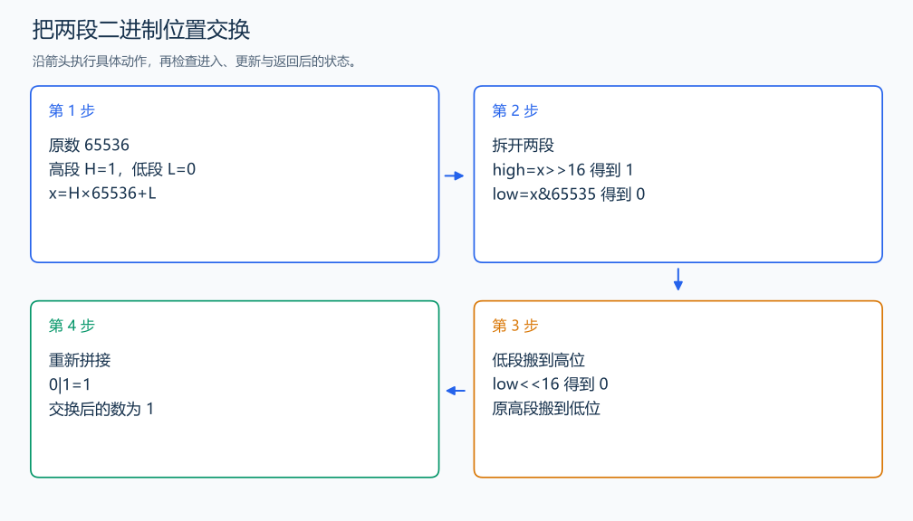

# P1100 高低位交换

[原题入口](https://www.luogu.com.cn/problem/P1100)

对应章节：一、C++ 语法基础 → （四） 运算符与位运算。

## （一） 任务与输出目标

交换一个 32 位非负整数的高 16 位与低 16 位。

## （二） 建模与推导

把原数写成 $x=H\cdot2^{16}+L$。右移 16 位得到 H，和 65535 按位与得到 L；交换后是 $L\cdot2^{16}+H$。两个部分占不同的位，用按位或拼接即可。

## （三） 手算与过程

x=65536，即 H=1、L=0；交换后为 1。



## （四） 带注释实现

[完整源文件](../../code/P1100.cpp)

```cpp
#include <iostream>
using namespace std;


int main() {
    unsigned long long x;
    cin >> x;
    auto high = x >> 16; // 去掉低 16 位，读出高位部分。
    auto low = x & 65535ULL; // 掩码只保留低 16 位。
    cout << ((low << 16) | high) << '\n'; // 把低位搬到高位，再拼上原高位。
}
```

## （五） 复杂度

时间 $O(1)$，额外空间 $O(1)$。

[返回本章题解索引](README.md) · [返回全部题号索引](../../README.md)
