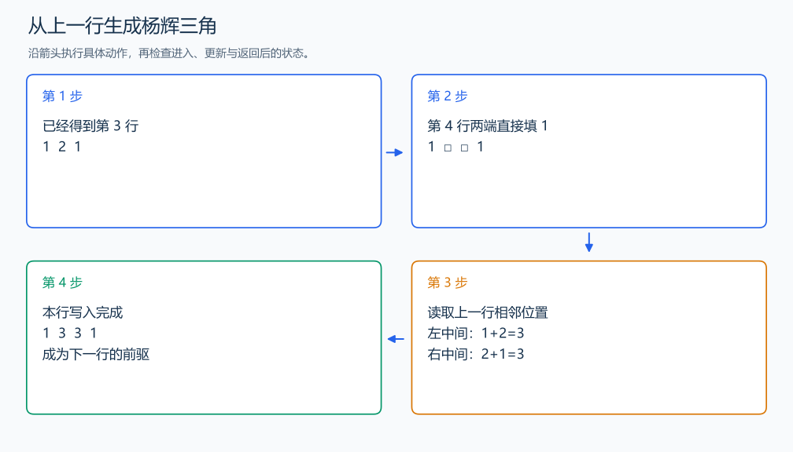

# P5732 杨辉三角

[原题入口](https://www.luogu.com.cn/problem/P5732)

对应章节：一、C++ 语法基础 → （六） 原生数组与枚举；一、C++ 语法基础 → （十五） STL：容器、迭代器与算法。

## （一） 任务与输出目标

输出杨辉三角的前 n 行。

## （二） 建模与推导

每行两端是 1，中间项来自上一行相邻两项之和。若当前行、列从 0 编号，中间项为 `a[row-1][col-1]+a[row-1][col]`。先填上两端，再计算中间，使每个读入的前驱都已经得到。

## （三） 手算与过程

前三行是 `1`、`1 1`、`1 2 1`；第四行中间两项分别由 1+2 和 2+1 得到。



## （四） 带注释实现

[完整源文件](../../code/P5732.cpp)

```cpp
#include <iostream>
using namespace std;


int main() {
    int n;
    cin >> n;
    long long a[20][20] = {}; // 用零初始化整张表。
    for (int row = 0; row < n; ++row) {
        a[row][0] = a[row][row] = 1; // 每行的两端都为 1。
        for (int col = 1; col < row; ++col)
            a[row][col] = a[row - 1][col - 1] + a[row - 1][col];
        for (int col = 0; col <= row; ++col)
            cout << a[row][col] << (col == row ? '\n' : ' ');
    }
}
```

## （五） 复杂度

时间 $O(n^2)$，保存三角形占 $O(n^2)$。

[返回本章题解索引](README.md) · [返回全部题号索引](../../README.md)
