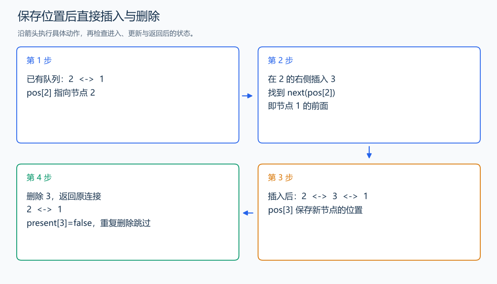

# P1160 队列安排

[原题入口](https://www.luogu.com.cn/problem/P1160)

对应章节：一、C++ 语法基础 → （十五） STL：容器、迭代器与算法。

## （一） 任务与输出目标

按指定人的左侧或右侧插入新同学，最后删除给定编号并输出队列。

## （二） 建模与推导

用 list 保持顺序，用 `pos[id]` 保存每个同学的迭代器。左侧插入就在 pos 前插入；右侧插入在 `next(pos)` 前插入。最后的删除阶段，用 present 记录人是否仍在队列中，重复删除时不再使用已经失效的迭代器。

## （三） 手算与过程

1 → 插入 2 到 1 左侧：2,1 → 插入 3 到 2 右侧：2,3,1 → 删除 3：2,1。



## （四） 带注释实现

[完整源文件](../../code/P1160.cpp)

```cpp
#include <bits/stdc++.h>
#define int long long
#define endl '\n'
using namespace std;

void solve() {
    int n;
    cin >> n;
    list<int> line{1};
    vector<list<int>::iterator> pos(n + 1);
    vector<bool> present(n + 1, true);
    pos[1] = line.begin();
    for (int id = 2; id <= n; ++id) {
        int k, side;
        cin >> k >> side;
        auto where = side == 0 ? pos[k] : next(pos[k]);
        pos[id] = line.insert(where, id); // 新迭代器保存新同学所在位置。
    }
    int m;
    cin >> m;
    while (m--) {
        int id;
        cin >> id;
        if (present[id]) {
            line.erase(pos[id]);
            present[id] = false;
        }
    }
    for (int id : line)
        cout << id << ' ';
    cout << '\n';
}

signed main() {
    ios::sync_with_stdio(false); // 关闭同步，使用 cin 与 cout 完成输入输出。
    cin.tie(0), cout.tie(0);

    int T = 1; // 本题读入一组数据。
    // cin >> T; // 题目给出测试组数时开启，并在 solve 中处理一组。
    while (T--)
        solve();
}
```

## （五） 复杂度

每次插入删除 $O(1)$，总时间 $O(n+m)$，空间 $O(n)$。

[返回本章题解索引](README.md) · [返回全部题号索引](../../README.md)
