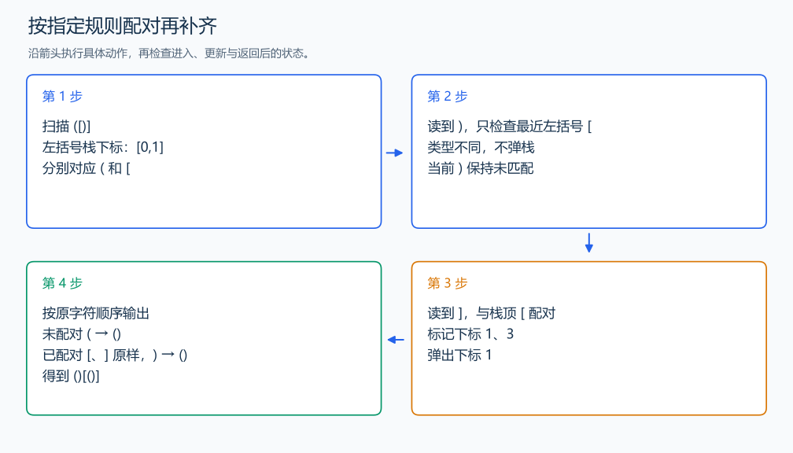

# P1241 括号序列

[原题入口](https://www.luogu.com.cn/problem/P1241)

对应章节：一、C++ 语法基础 → （十五） STL：容器、迭代器与算法。

## （一） 任务与输出目标

按题目指定的最近未匹配左括号规则配对，再给未配对字符补上相应括号。

## （二） 建模与推导

栈保存未匹配左括号的下标。右括号只考察栈顶；类型相同才标记双方已匹配并弹栈，类型不同则保留栈顶，当前右括号未配对。第二遍按原字符串顺序输出：配好的字符原样输出，未配对的小括号输出 ()，未配对的中括号输出 []。这是执行指定配对规则，不是另求最少插入的通用括号 DP。

## （三） 手算与过程

`([)]` 中 ) 遇到栈顶 [，不配对；随后 ] 与 [ 配对。未配对的 ( 和 ) 各自补齐，得到 `()[()]`。



## （四） 带注释实现

[完整源文件](../../code/P1241.cpp)

```cpp
#include <bits/stdc++.h>
#define int long long
#define endl '\n'
using namespace std;

void solve() {
    string s;
    cin >> s;
    vector<bool> matched(s.size(), false);
    stack<int> left;
    for (int i = 0; i < (int)s.size(); ++i) {
        if (s[i] == '(' || s[i] == '[')
            left.push(i);
        else if (!left.empty()) {
            char c = s[left.top()];
            if ((c == '(' && s[i] == ')') || (c == '[' && s[i] == ']')) {
                matched[i] = matched[left.top()] = true;
                left.pop(); // 只移除成功配对的左括号。
            }
        }
    }
    for (int i = 0; i < (int)s.size(); ++i)
        if (matched[i])
            cout << s[i];
        else
            cout << ((s[i] == '(' || s[i] == ')') ? "()" : "[]");
    cout << '\n';
}

signed main() {
    ios::sync_with_stdio(false); // 关闭同步，使用 cin 与 cout 完成输入输出。
    cin.tie(0), cout.tie(0);

    int T = 1; // 本题读入一组数据。
    // cin >> T; // 题目给出测试组数时开启，并在 solve 中处理一组。
    while (T--)
        solve();
}
```

## （五） 复杂度

两次扫描，时间 $O(L)$，标记与栈占 $O(L)$。

[返回本章题解索引](README.md) · [返回全部题号索引](../../README.md)
