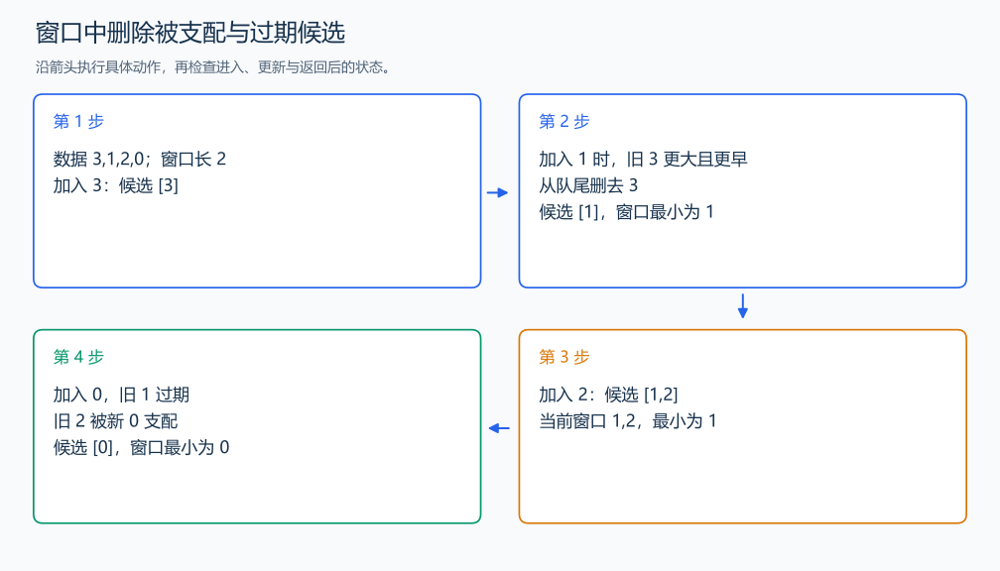

# P1440 求 m 区间内的最小值

[原题入口](https://www.luogu.com.cn/problem/P1440)

对应章节：一、C++ 语法基础 → （十五） STL：容器、迭代器与算法。

## （一） 任务与输出目标

对每项输出此前最多 k 项的最小值，第一项输出 0。

## （二） 建模与推导

队列保存候选下标，从前到后值递增。新值 x 到来时，队尾中不小于 x 的旧值可以移除：x 更小且位置更晚，以后的窗口中旧值能出现时，x 也能出现。队头过期就移除；留下的队头是最小值。求最大值时反向比较即可。

本题查询的是当前项之前的数，先删除过期下标、输出队头，再把当前项放入。

## （三） 手算与过程

a=3,1,2,0，k=2：输出 0、3、1、1；输出第四项前只看 1、2。



## （四） 带注释实现

[完整源文件](../../code/P1440.cpp)

```cpp
#include <bits/stdc++.h>
using namespace std;


int main() {
    int n, k; cin >> n >> k;
    vector<int> a(n);
    for (int& x : a) cin >> x;
    deque<int> low, high;
    for (int i = 0; i < n; ++i) {
        while (!low.empty() && low.front() < i - k) low.pop_front(); // 只保留此前 k 项。
        cout << (low.empty() ? 0 : a[low.front()]) << '\n'; // 先查询，不把当前项计入。
        while (!low.empty() && a[low.back()] >= a[i]) low.pop_back();
        low.push_back(i); // 当前项供后面的查询使用。
    }
}
```

头文件 `<bits/stdc++.h>` 汇总 GNU C++ 的常用标准库，包含本程序使用的流、容器与算法；这是序言竞赛模板中的包含方式。

## （五） 复杂度

每个下标入队一次、从两端合计移除至多一次，时间 $O(n)$；存入数据和输出占 $O(n)$，候选队列占 $O(k)$。

[返回本章题解索引](README.md) · [返回全部题号索引](../../README.md)
