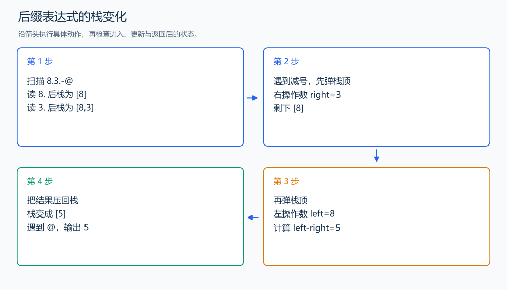

# P1449 后缀表达式

[原题入口](https://www.luogu.com.cn/problem/P1449)

对应章节：一、C++ 语法基础 → （十五） STL：容器、迭代器与算法。

## （一） 任务与输出目标

计算由数字、点号、四则运算符和结束符 @ 组成的后缀表达式。

## （二） 建模与推导

扫描到数字时用 `value=value*10+digit` 累积多位数；点号结束一个操作数，把它压栈。遇到运算符时，先取出的栈顶是右操作数，第二次取出的是左操作数，运算后把结果压回。每轮栈中保存尚未被后续运算合并的表达式值。

## （三） 手算与过程

`8.3.-@`：压入 8、3，先弹 3 再弹 8，计算 8-3=5，压回并输出 5。



## （四） 带注释实现

[完整源文件](../../code/P1449.cpp)

```cpp
#include <bits/stdc++.h>
#define int long long
#define endl '\n'
using namespace std;

void solve() {
    string s;
    cin >> s;
    stack<int> values;
    int value = 0;
    for (char c : s) {
        if (isdigit(static_cast<unsigned char>(c)))
            value = value * 10 + c - '0';
        else if (c == '.') {
            values.push(value);
            value = 0;
        } else if (c == '@')
            break;
        else {
            int right = values.top();
            values.pop(); // 后压入的是右操作数。
            int left = values.top();
            values.pop();
            if (c == '+')
                values.push(left + right);
            if (c == '-')
                values.push(left - right);
            if (c == '*')
                values.push(left * right);
            if (c == '/')
                values.push(left / right); // C++ 整数除法向 0 取整。
        }
    }
    cout << values.top() << '\n';
}

signed main() {
    ios::sync_with_stdio(false); // 关闭同步，使用 cin 与 cout 完成输入输出。
    cin.tie(0), cout.tie(0);

    int T = 1; // 本题读入一组数据。
    // cin >> T; // 题目给出测试组数时开启，并在 solve 中处理一组。
    while (T--)
        solve();
}
```

## （五） 复杂度

表达式长 L，时间 $O(L)$，栈占 $O(L)$。

[返回本章题解索引](README.md) · [返回全部题号索引](../../README.md)
