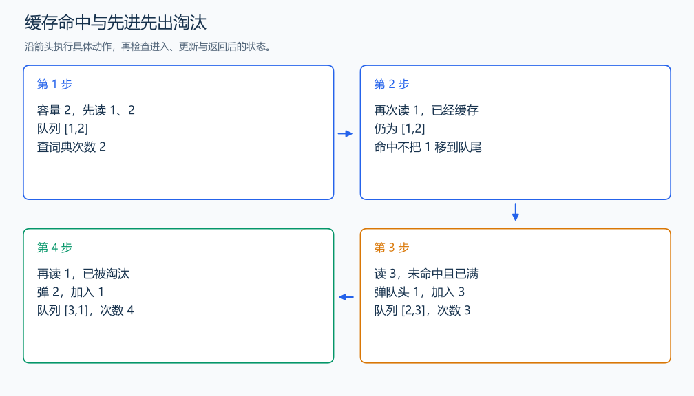

# P1540 机器翻译

[原题入口](https://www.luogu.com.cn/problem/P1540)

对应章节：一、C++ 语法基础 → （十五） STL：容器、迭代器与算法。

## （一） 任务与输出目标

用先进先出的容量为 M 的缓存翻译单词，统计访问外部词典的次数。

## （二） 建模与推导

队列保存进入缓存的先后，布尔数组保存某词是否已经缓存。命中时什么也不移动；未命中时次数加一，缓存满就移除队头，再加入当前词。命中不更新队列顺序，这是 FIFO 与按最近访问淘汰的区别。

## （三） 手算与过程

容量 2，输入 1、2、1、3、1：前两次查词典，第三次命中，3 淘汰最早的 1，最后的 1 再查词典，共 4 次。



## （四） 带注释实现

[完整源文件](../../code/P1540.cpp)

```cpp
#include <bits/stdc++.h>
using namespace std;


int main() {
    int m, n, answer = 0; cin >> m >> n;
    queue<int> q;
    bool cached[1001] = {};
    while (n--) {
        int word; cin >> word;
        if (cached[word]) continue; // 缓存命中，不改变进入顺序。
        ++answer;
        if ((int)q.size() == m) { cached[q.front()] = false; q.pop(); }
        q.push(word); cached[word] = true;
    }
    cout << answer << '\n';
}
```

头文件 `<bits/stdc++.h>` 汇总 GNU C++ 的常用标准库，包含本程序使用的流、容器与算法；这是序言竞赛模板中的包含方式。

## （五） 复杂度

每个词至多入队出队一次，时间 $O(n)$；队列占 $O(M)$，词号标记数组为 1001 项。

[返回本章题解索引](README.md) · [返回全部题号索引](../../README.md)
