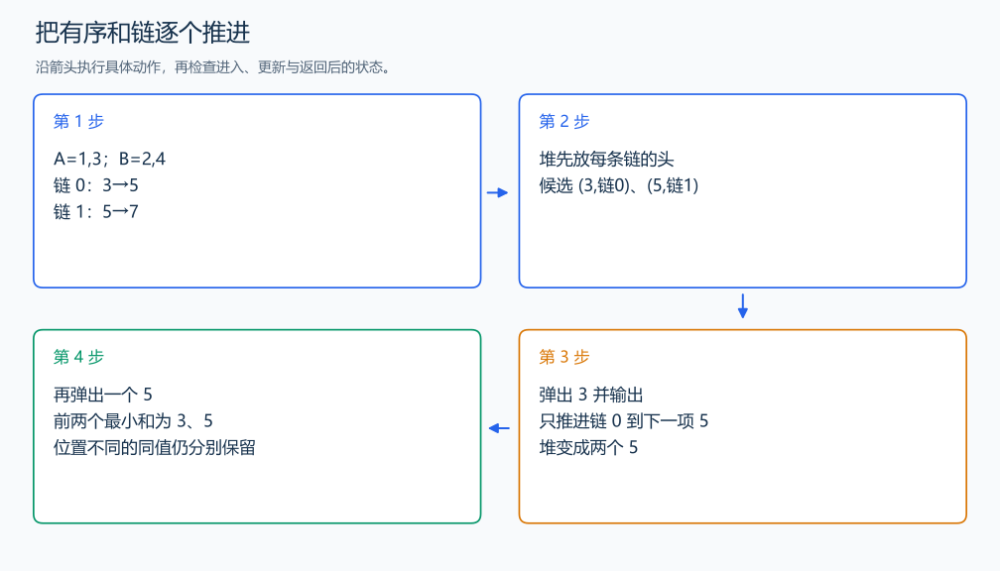

# P1631 序列合并

[原题入口](https://www.luogu.com.cn/problem/P1631)

对应章节：一、C++ 语法基础 → （十五） STL：容器、迭代器与算法。

## （一） 任务与输出目标

从两个非降序列的所有两两之和中，输出最小的 n 个，保留重复位置形成的和。

## （二） 建模与推导

固定 A 的一个位置 i，`A[i]+B[0], A[i]+B[1], ...` 就是一条有序链。n 条链一起合并：先把每条链的第一项放入小根堆，弹出最小项后，仅把同一条链的下一项放入。每个尚未输出的链都有一个最小候选在堆中，因此每次堆顶都是全体剩余项的最小值；重复和属于不同位置，仍分别输出。

## （三） 手算与过程

A=1,3，B=2,4：两条链为 3→5 和 5→7，依次弹出 3、5。



## （四） 带注释实现

[完整源文件](../../code/P1631.cpp)

```cpp
#include <bits/stdc++.h> // 竞赛模板中的常用标准库工具。
#define int long long   // 统一使用较大的整数类型。
#define endl '\n'       // 普通输出换行，避免逐行刷新。
using namespace std;

void solve() {
    int n; cin >> n;
    vector<long long> a(n), b(n);
    for (auto& x : a) cin >> x;
    for (auto& x : b) cin >> x;
    using State = tuple<long long, int, int>; // 保存和、A 的位置、B 的位置。
    priority_queue<State, vector<State>, greater<State>> heap;
    for (int i = 0; i < n; ++i) heap.emplace(a[i] + b[0], i, 0);
    for (int k = 0; k < n; ++k) {
        auto [sum, i, j] = heap.top(); heap.pop();
        cout << sum << ' ';
        if (j + 1 < n) heap.emplace(a[i] + b[j + 1], i, j + 1); // 只推进被取走的那条链。
    }
    cout << '\n';
}

signed main() {
    ios::sync_with_stdio(false); // 关闭同步，使用 cin 与 cout 完成输入输出。
    cin.tie(0), cout.tie(0);

    int T = 1; // 本题读入一组数据。
    // cin >> T; // 题目给出测试组数时开启，并在 solve 中处理一组。
    while (T--)
        solve();
}
```

头文件 `<bits/stdc++.h>` 汇总 GNU C++ 的常用标准库，包含本程序使用的流、容器与算法；这是序言竞赛模板中的包含方式。

## （五） 复杂度

建堆与 n 次推进共 $O(n\log n)$，空间 $O(n)$。

[返回本章题解索引](README.md) · [返回全部题号索引](../../README.md)
