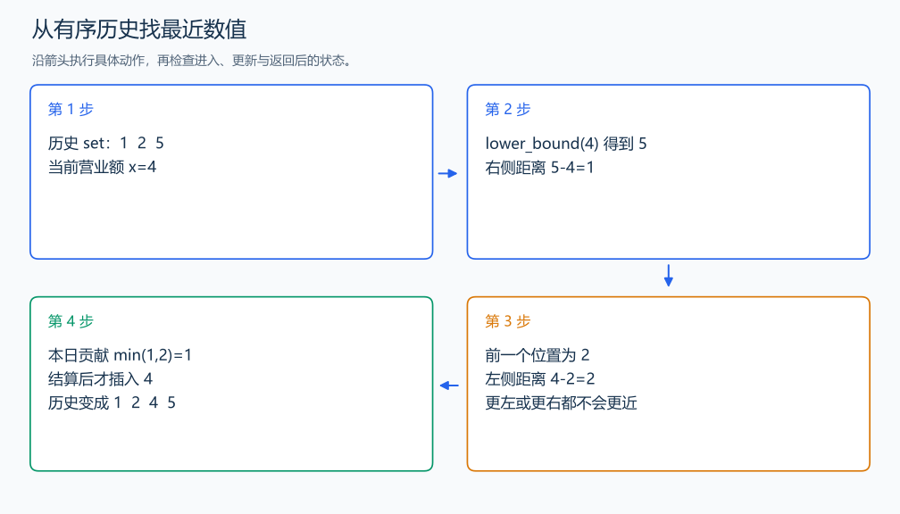

# P2234 营业额统计

[原题入口](https://www.luogu.com.cn/problem/P2234)

对应章节：一、C++ 语法基础 → （十五） STL：容器、迭代器与算法。

## （一） 任务与输出目标

第一天计入当天营业额，之后每天加上与此前营业额最接近的绝对差。

## （二） 建模与推导

把过去的营业额放入有序 set。当前值 x 的最近历史值只可能是第一个不小于 x 的数，或它前面的数：更远的数在同一侧，差值不会更小。先求差再插入，当前日才不会拿自己与自己比较。重复营业额直接得到差 0。

## （三） 手算与过程

5、1、2、5、4、6 的贡献为 5、4、1、0、1、1，总和 12。



## （四） 带注释实现

[完整源文件](../../code/P2234.cpp)

```cpp
#include <bits/stdc++.h> // 竞赛模板中的常用标准库工具。
#define int long long   // 统一使用较大的整数类型。
#define endl '\n'       // 普通输出换行，避免逐行刷新。
using namespace std;

void solve() {
    int n; cin >> n;
    set<long long> history;
    long long answer = 0;
    for (int i = 0; i < n; ++i) {
        long long x; cin >> x;
        if (history.empty()) answer += x; // 第一天按题目定义计入自身值。
        else {
            long long best = LLONG_MAX;
            auto it = history.lower_bound(x);
            if (it != history.end()) best = *it - x;
            if (it != history.begin()) best = min(best, x - *prev(it));
            answer += best;
        }
        history.insert(x); // 完成当天统计后，才成为后续日期的历史。
    }
    cout << answer << '\n';
}

signed main() {
    ios::sync_with_stdio(false); // 关闭同步，使用 cin 与 cout 完成输入输出。
    cin.tie(0), cout.tie(0);

    int T = 1; // 本题读入一组数据。
    // cin >> T; // 题目给出测试组数时开启，并在 solve 中处理一组。
    while (T--)
        solve();
}
```

头文件 `<bits/stdc++.h>` 汇总 GNU C++ 的常用标准库，包含本程序使用的流、容器与算法；这是序言竞赛模板中的包含方式。

## （五） 复杂度

时间 $O(n\log n)$，空间 $O(n)$。

[返回本章题解索引](README.md) · [返回全部题号索引](../../README.md)
