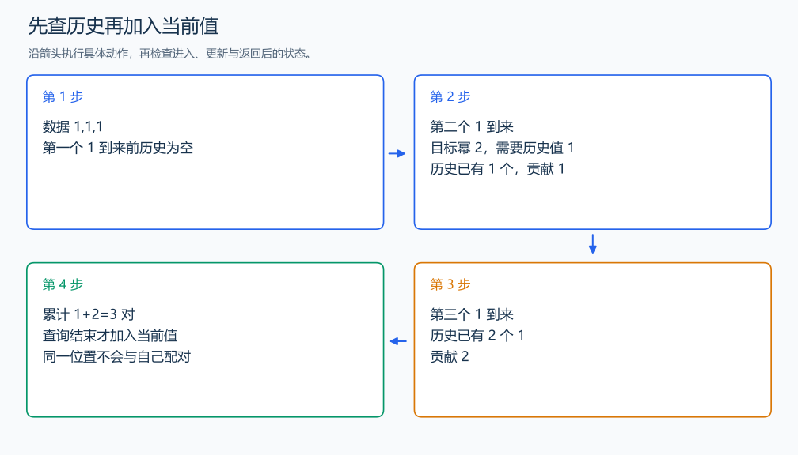

# CF702-B Powers of Two

[原题入口](https://codeforces.com/problemset/problem/702/B)

对应章节：三、解题方法论：从题意到代码 → （十二） 一题多建模与最优方法的选择过程；三、解题方法论：从题意到代码 → （十七） 解题复盘与模型迁移。

## （一） 任务与输出目标

统计 i<j 且两数之和为 2 的幂的位置对。

## （二） 建模与推导

新值 x 到来时枚举幂 p，过去的值 p-x 都能与它配对。先查询再加入 x，每对只在右端点到来时统计，也不会把一个位置与自己配对。两个数之和不超过 2×10^9，枚举 2^0 到 2^30 即可。

## （三） 手算与过程

1,1,1：第二个贡献 1，第三个贡献 2，共 3 对。



## （四） 带注释实现

[完整源文件](../../code/CF702-B.cpp)

```cpp
#include <bits/stdc++.h>
#define int long long
#define endl '\n'
using namespace std;

void solve() {
    int n;
    cin >> n;
    unordered_map<int, int> past;
    int answer = 0;
    while (n--) {
        int x;
        cin >> x;
        for (int p = 1; p <= (1LL << 30); p <<= 1) {
            auto it = past.find(p - x);
            if (it != past.end())
                answer += it->second; // 查询范围只有此前的位置。
        }
        ++past[x]; // 查询结束后才进入历史。
    }
    cout << answer << '\n';
}

signed main() {
    ios::sync_with_stdio(false); // 关闭同步，使用 cin 与 cout 完成输入输出。
    cin.tie(0), cout.tie(0);

    int T = 1; // 本题读入一组数据。
    // cin >> T; // 题目给出测试组数时开启，并在 solve 中处理一组。
    while (T--)
        solve();
}
```

## （五） 复杂度

D=31 个幂，哈希平均时间 $O(nD)$，极端碰撞最坏 $O(n^2D)$，空间 $O(n)$。

[返回本章题解索引](README.md) · [返回全部题号索引](../../README.md)
