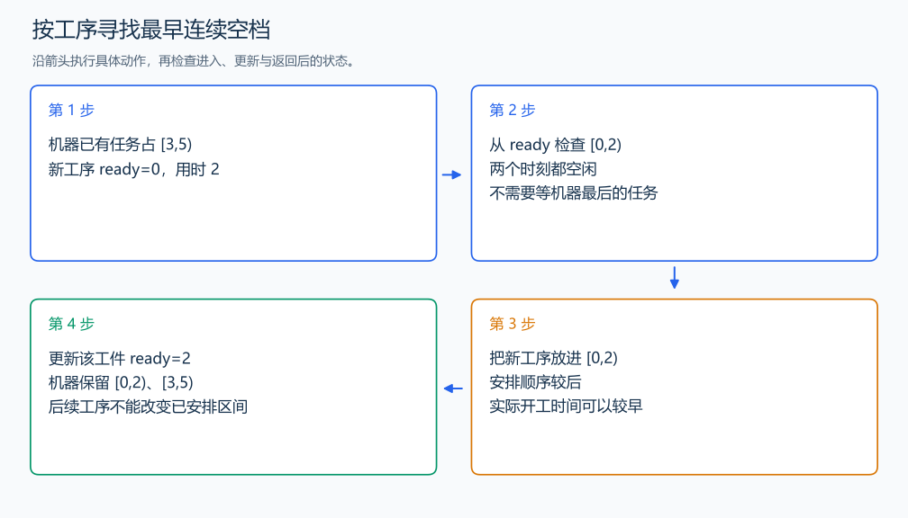

# P1065 作业调度方案

[原题入口](https://www.luogu.com.cn/problem/P1065)

对应章节：三、解题方法论：从题意到代码 → （十三） 复杂题面到事件模拟的完整推导；三、解题方法论：从题意到代码 → （十七） 解题复盘与模型迁移。

## （一） 任务与输出目标

按安排顺序，把每道工序放进指定机器最早可容纳的空档，求全部完成时间。

## （二） 建模与推导

安排顺序与实际开工时间不同。`next[j]` 指示工件 j 的下一道工序，`ready[j]` 是上一道的完成时间。从 ready 开始检查机器占用情况，找连续 duration 个空闲时刻，填入这一段。时间轴用所有工序时长之和：即使全串行执行也能完成，因此能容纳模拟结果。只把任务接在机器最后，会漏掉前面的空档。

## （三） 手算与过程

同一机器上的两个工件分别用时 3 和 2，依次占 [0,3)、[3,5)，全部完成时间为 5。



## （四） 带注释实现

[完整源文件](../../code/P1065.cpp)

```cpp
#include <bits/stdc++.h>
using namespace std;


int main() {
    int m, n; cin >> m >> n;
    vector<int> order(m * n);
    for (int& x : order) { cin >> x; --x; }
    vector<vector<int>> machine(n, vector<int>(m)), duration(n, vector<int>(m));
    for (auto& row : machine) for (int& x : row) { cin >> x; --x; }
    int total = 0;
    for (auto& row : duration) for (int& x : row) { cin >> x; total += x; }
    vector<vector<bool>> busy(m, vector<bool>(total, false));
    vector<int> next(n, 0), ready(n, 0);
    int answer = 0;
    for (int job : order) {
        int step = next[job]++, id = machine[job][step], length = duration[job][step];
        int start = ready[job];
        while (true) {
            int used = -1;
            for (int t = start; t < start + length; ++t)
                if (busy[id][t]) { used = t; break; }
            if (used == -1) break; // 这一段完全空闲。
            start = used + 1; // 越过导致放不下的占用时刻。
        }
        for (int t = start; t < start + length; ++t) busy[id][t] = true;
        ready[job] = start + length;
        answer = max(answer, ready[job]);
    }
    cout << answer << '\n';
}
```

头文件 `<bits/stdc++.h>` 汇总 GNU C++ 的常用标准库，包含本程序使用的流、容器与算法；这是序言竞赛模板中的包含方式。

## （五） 复杂度

K=mn 道工序，时间轴长 S，单道最长 D；时间上界 $O(KSD)$，空间 $O(mS+K)$。题目中 m、n 小于 20，单道时长不超过 20。

[返回本章题解索引](README.md) · [返回全部题号索引](../../README.md)
