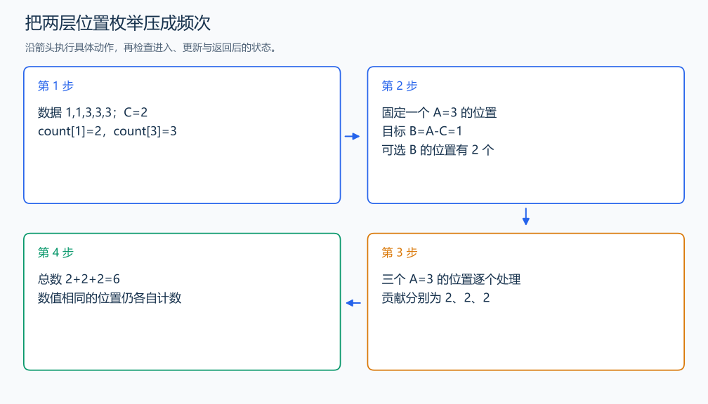

# P1102 A-B 数对

[原题入口](https://www.luogu.com.cn/problem/P1102)

对应章节：三、解题方法论：从题意到代码 → （十二） 一题多建模与最优方法的选择过程；三、解题方法论：从题意到代码 → （十七） 解题复盘与模型迁移；五、数据结构与算法 → （一） 时间复杂度与空间复杂度；五、数据结构与算法 → （九） 双指针与滑动窗口（尺取法）；五、数据结构与算法 → （十） 二分与三分搜索。

## （一） 任务与输出目标

统计差为 C 的位置对，相同值的不同位置分别计数。

## （二） 建模与推导

固定 A，寻找 B=A-C。预先保存每个值的出现次数，一个 A 的位置就贡献 `count[A-C]` 对。3 出现两次、1 出现三次且 C=2 时，贡献为 2×3=6。A、B 由数值关系确定，不要求 A 的输入位置在 B 前。

## （三） 手算与过程

1,1,3,3,3，C=2：三个 3 各与两个 1 配对，共 6 对。



## （四） 带注释实现

[完整源文件](../../code/P1102.cpp)

```cpp
#include <bits/stdc++.h> // 竞赛模板中的常用标准库工具。
#define int long long   // 统一使用较大的整数类型。
#define endl '\n'       // 普通输出换行，避免逐行刷新。
using namespace std;

void solve() {
    int n; long long c; cin >> n >> c;
    vector<long long> a(n);
    map<long long, long long> count;
    for (auto& x : a) { cin >> x; ++count[x]; }
    long long answer = 0;
    for (long long x : a) {
        auto it = count.find(x - c); // 查出每个 A 能配上的 B 的位置数。
        if (it != count.end()) answer += it->second;
    }
    cout << answer << '\n';
}

signed main() {
    ios::sync_with_stdio(false); // 关闭同步，使用 cin 与 cout 完成输入输出。
    cin.tie(0), cout.tie(0);

    int T = 1; // 本题读入一组数据。
    // cin >> T; // 题目给出测试组数时开启，并在 solve 中处理一组。
    while (T--)
        solve();
}
```

头文件 `<bits/stdc++.h>` 汇总 GNU C++ 的常用标准库，包含本程序使用的流、容器与算法；这是序言竞赛模板中的包含方式。

## （五） 复杂度

时间 $O(n\log n)$，空间 $O(n)$。

[返回本章题解索引](README.md) · [返回全部题号索引](../../README.md)
