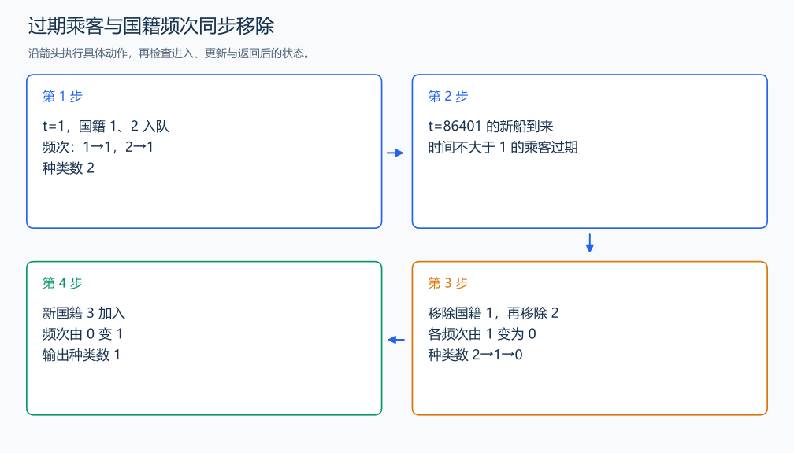

# P2058 海港

[原题入口](https://www.luogu.com.cn/problem/P2058)

对应章节：三、解题方法论：从题意到代码 → （十三） 复杂题面到事件模拟的完整推导；三、解题方法论：从题意到代码 → （十七） 解题复盘与模型迁移。

## （一） 任务与输出目标

每艘船到达后统计此前 86400 秒内乘客国籍的种类数。

## （二） 建模与推导

时间递增，过期乘客总在队头。队列保存 (时间,国籍)，频次数组保存窗口内每个国籍的人数。加入时由 0 变 1，种类加一；移除时由 1 变 0，种类减一。时间 t 到来时，移除所有时间不大于 t-86400 的乘客。人数和国籍种数是两个不同的量。

## （三） 手算与过程

时间 1 的船载国籍 1、2；时间 86401 的船载国籍 3，前一船过期，输出从 2 变为 1。



## （四） 带注释实现

[完整源文件](../../code/P2058.cpp)

```cpp
#include <bits/stdc++.h>
#define int long long
#define endl '\n'
using namespace std;

void solve() {
    int n;
    cin >> n;
    queue<pair<int, int>> q;
    vector<int> count(100001, 0);
    int kinds = 0;
    while (n--) {
        int time, k;
        cin >> time >> k;
        while (!q.empty() && q.front().first <= time - 86400) {
            int country = q.front().second;
            q.pop();
            if (--count[country] == 0)
                --kinds; // 该国籍的最后一个人离开窗口。
        }
        while (k--) {
            int country;
            cin >> country;
            if (count[country]++ == 0)
                ++kinds;
            q.emplace(time, country);
        }
        cout << kinds << '\n';
    }
}

signed main() {
    ios::sync_with_stdio(false); // 关闭同步，使用 cin 与 cout 完成输入输出。
    cin.tie(0), cout.tie(0);

    int T = 1; // 本题读入一组数据。
    // cin >> T; // 题目给出测试组数时开启，并在 solve 中处理一组。
    while (T--)
        solve();
}
```

## （五） 复杂度

总乘客 K，每人至多入队出队一次，时间 $O(n+K)$，队列空间 $O(K)$。

[返回本章题解索引](README.md) · [返回全部题号索引](../../README.md)
