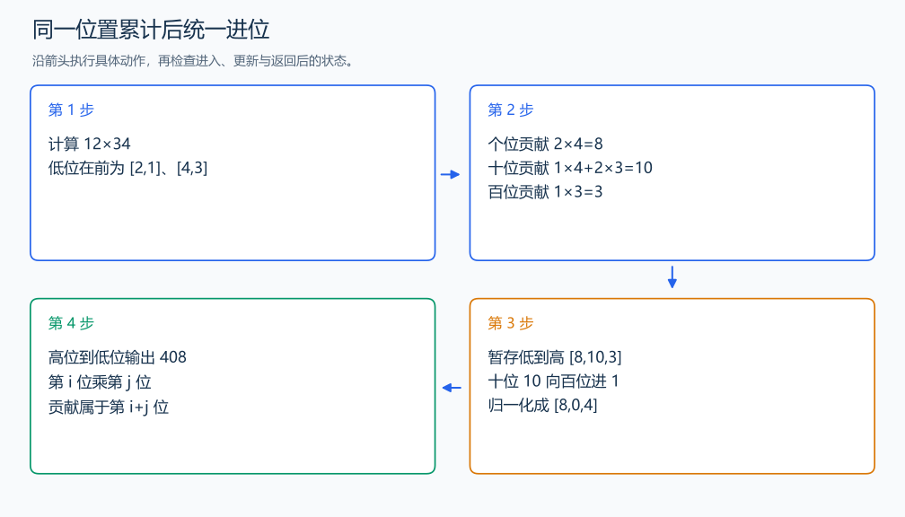

# P1303 A*B Problem

[原题入口](https://www.luogu.com.cn/problem/P1303)

对应章节：四、批量输入、大整数运算与提交检查 → （二） 大整数的加减乘除。

## （一） 任务与输出目标

输出两个非负大整数的乘积。

## （二） 建模与推导

从低位编号，第 i 位乘第 j 位的贡献属于第 i+j 位，因为 10^i×10^j=10^(i+j)。先累计所有这些贡献，再从低到高统一进位。结果最高处多余的 0 去掉后逆序输出；整积为零时保留一个 0。

## （三） 手算与过程

12×34：低位贡献为 2×4=8，十位为 1×4+2×3=10，百位为 1×3=3；十位进位后得到 408。



## （四） 带注释实现

[完整源文件](../../code/P1303.cpp)

```cpp
#include <bits/stdc++.h>
#define int long long
#define endl '\n'
using namespace std;

void solve() {
    string a, b;
    cin >> a >> b;
    int n = a.size(), m = b.size();
    vector<int> digit(n + m + 1, 0);
    for (int i = 0; i < n; ++i)
        for (int j = 0; j < m; ++j)
            digit[i + j] += 1LL * (a[n - 1 - i] - '0') * (b[m - 1 - j] - '0'); // 数位位置相加。
    for (int i = 0; i < n + m; ++i) {
        digit[i + 1] += digit[i] / 10;
        digit[i] %= 10;
    }
    int end = n + m;
    while (end > 0 && digit[end] == 0)
        --end;
    for (int i = end; i >= 0; --i)
        cout << digit[i];
    cout << '\n';
}

signed main() {
    ios::sync_with_stdio(false); // 关闭同步，使用 cin 与 cout 完成输入输出。
    cin.tie(0), cout.tie(0);

    int T = 1; // 本题读入一组数据。
    // cin >> T; // 题目给出测试组数时开启，并在 solve 中处理一组。
    while (T--)
        solve();
}
```

## （五） 复杂度

时间 $O(nm)$，空间 $O(n+m)$。

[返回本章题解索引](README.md) · [返回全部题号索引](../../README.md)
