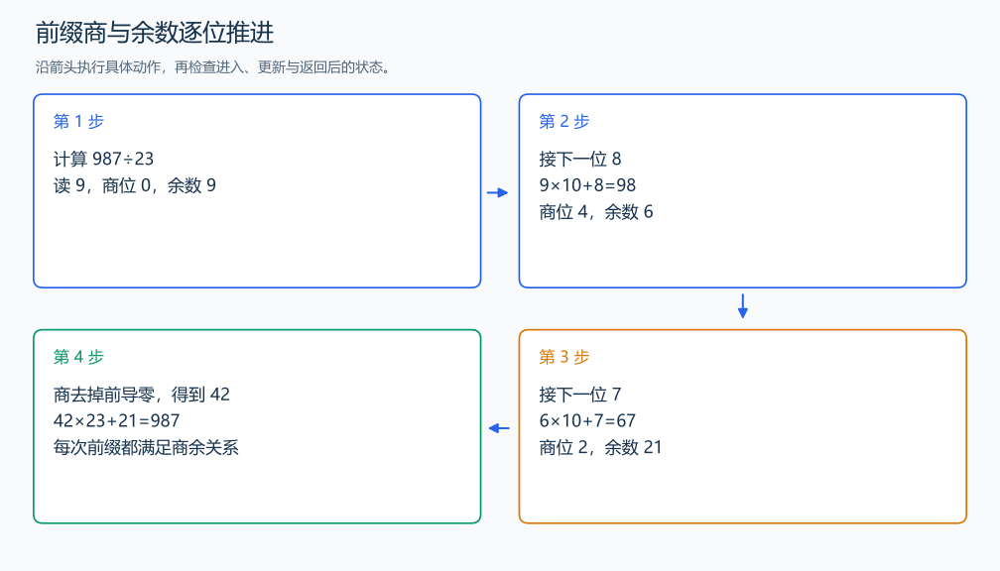

# P1480 A/B Problem

[原题入口](https://www.luogu.com.cn/problem/P1480)

对应章节：四、批量输入、大整数运算与提交检查 → （二） 大整数的加减乘除。

## （一） 任务与输出目标

一个大整数除以普通正整数，输出整数商。

## （二） 建模与推导

从最高位开始读。上一轮余数 rem 与新数码 d 组成 rem×10+d；这一值除以 b 得到本位商，取余得到下一轮余数。每轮保持“已经读入的前缀=已经产生的商×b+rem”，最后商就是原整数除以 b 的整数部分。商的前导零跳过，整商为 0 时输出 0。

## （三） 手算与过程

987÷23：先读 9 得商位 0、余 9；再读 8 得 98，商位 4、余 6；读 7 得 67，商位 2、余 21，整数商为 42。



## （四） 带注释实现

[完整源文件](../../code/P1480.cpp)

```cpp
#include <bits/stdc++.h>
#define int long long
#define endl '\n'
using namespace std;

void solve() {
    string a;
    int b;
    cin >> a >> b;
    int remainder = 0;
    string quotient;
    for (char c : a) {
        remainder = remainder * 10 + c - '0';
        quotient.push_back('0' + remainder / b); // 当前前缀产生的这一位商。
        remainder %= b;
    }
    auto first = quotient.find_first_not_of('0');
    cout << (first == string::npos ? "0" : quotient.substr(first)) << '\n';
}

signed main() {
    ios::sync_with_stdio(false); // 关闭同步，使用 cin 与 cout 完成输入输出。
    cin.tie(0), cout.tie(0);

    int T = 1; // 本题读入一组数据。
    // cin >> T; // 题目给出测试组数时开启，并在 solve 中处理一组。
    while (T--)
        solve();
}
```

## （五） 复杂度

时间 $O(n)$，保存商占 $O(n)$。

[返回本章题解索引](README.md) · [返回全部题号索引](../../README.md)
