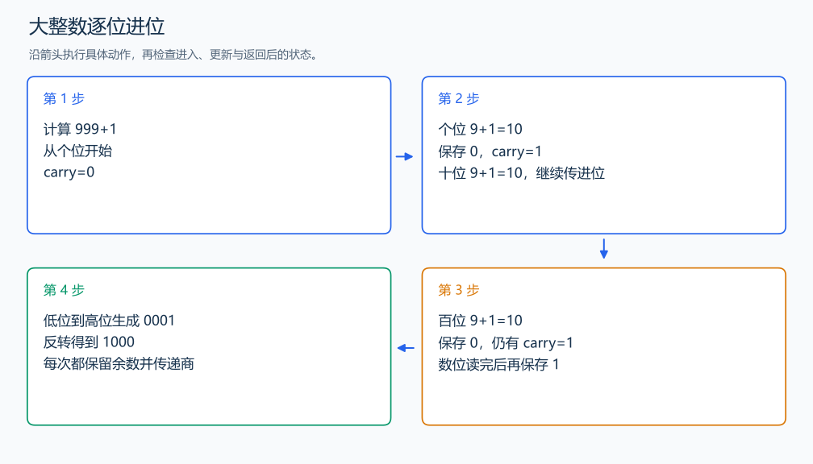

# P1601 高精度加法

[原题入口](https://www.luogu.com.cn/problem/P1601)

对应章节：四、批量输入、大整数运算与提交检查 → （二） 大整数的加减乘除。

## （一） 任务与输出目标

输出两个大整数之和。

## （二） 建模与推导

把整数保存为字符串，从末尾对应的个位开始相加。当前位的两数码加上上一位进位，余数写入结果，商作为新进位。两个字符串长度不同时，已经读完的一边贡献 0；全部数位结束后仍有进位就继续处理。结果按低位到高位产生，最后反转。

## （三） 手算与过程

999+1：三个位都得到 10，连续保存 0 并传递进位 1，最后得到 1000。



## （四） 带注释实现

[完整源文件](../../code/P1601.cpp)

```cpp
#include <bits/stdc++.h> // 竞赛模板中的常用标准库工具。
#define int long long   // 统一使用较大的整数类型。
#define endl '\n'       // 普通输出换行，避免逐行刷新。
using namespace std;

string add(string a,string b){
    int i=a.size()-1,j=b.size()-1,carry=0;string result;
    while(i>=0||j>=0||carry){
        int value=carry;
        if(i>=0)value+=a[i--]-'0';if(j>=0)value+=b[j--]-'0';
        result.push_back('0'+value%10);carry=value/10; // 当前位取余，高位承接进位。
    }
    reverse(result.begin(),result.end());return result;
}

void solve() {
    string a,b;cin>>a>>b;
    cout<<add(a,b)<<'\n'; // 所有数位都由字符串保存。
}

signed main() {
    ios::sync_with_stdio(false); // 关闭同步，使用 cin 与 cout 完成输入输出。
    cin.tie(0), cout.tie(0);

    int T = 1; // 本题读入一组数据。
    // cin >> T; // 题目给出测试组数时开启，并在 solve 中处理一组。
    while (T--)
        solve();
}
```

头文件 `<bits/stdc++.h>` 汇总 GNU C++ 的常用标准库，包含本程序使用的流、容器与算法；这是序言竞赛模板中的包含方式。

## （五） 复杂度

位数 n、m，时间 $O(n+m)$，空间 $O(n+m)$。

[返回本章题解索引](README.md) · [返回全部题号索引](../../README.md)
