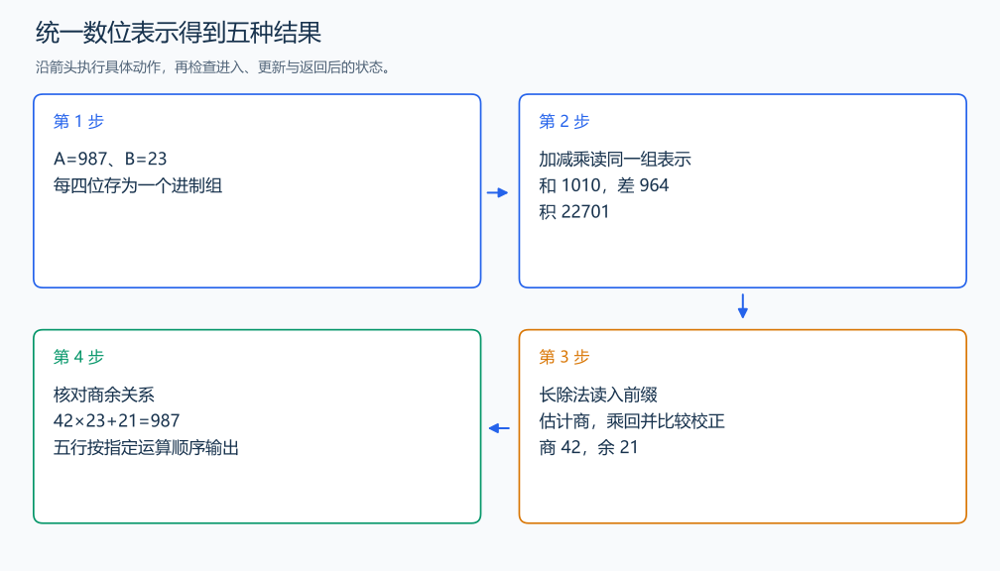

# P1932 大整数五种运算

[原题入口](https://www.luogu.com.cn/problem/P1932)

对应章节：四、批量输入、大整数运算与提交检查 → （二） 大整数的加减乘除。

## （一） 任务与输出目标

依次输出 A+B、A-B、A×B、A÷B 的整数商和余数。

## （二） 建模与推导

每四位十进制数码组成一组，以 10000 为进制、低位在前保存。与逐位算法相比，20000 位变成约 5000 组；加法的进位、减法的借位、乘法的组位置相加完全沿用原来的推导。减法先比较绝对值，输出符号后做较大减较小。

除法仍按“旧余数乘进制、接下一组、确定商、减去商×除数”执行。为快速确定商，把两数同时乘 factor，使除数最高组不小于进制的一半。用余数最高两组除以除数最高组，得到不低于真实值、至多偏大两次的估计。每次发现乘积大于余数，就把估计减一、乘积减去一个除数。确认后写入商组，并把余数减去对应乘积。

共同放大不改变商，最后余数再除以 factor。每轮保持“已读前缀=商前缀×放大后的除数+余数”。因为估计来自最高部分，是真实商的上方候选，校正不会错过正确商。读入、比较、格式化分别放在类的方法里，五种运算共用同一存储表示。

## （三） 手算与过程

A=987、B=23：和 1010、差 964、积 22701、商 42、余 21；42×23+21 恢复原数 987。



## （四） 带注释实现

[完整源文件](../../code/P1932.cpp)

```cpp
#include <bits/stdc++.h> // 竞赛模板中的常用标准库工具。
#define int long long   // 统一使用较大的整数类型。
#define endl '\n'       // 普通输出换行，避免逐行刷新。
using namespace std;

struct Big {
    static const int base=10000;
    vector<int>d; // 低位在前，每项存四个十进制数码。
    Big(long long x=0){do{d.push_back(x%base);x/=base;}while(x);}
    Big(string s){for(int end=s.size();end>0;end-=4)d.push_back(stoi(s.substr(max(0LL,end-4),min(4LL,end))));trim();}
    void trim(){while(d.size()>1&&d.back()==0)d.pop_back();}
    int compare(const Big& b)const{
        if(d.size()!=b.d.size())return d.size()<b.d.size()?-1:1;
        for(int i=d.size()-1;i>=0;--i)if(d[i]!=b.d[i])return d[i]<b.d[i]?-1:1;
        return 0;
    }
    string str()const{
        ostringstream out;out<<d.back();
        for(int i=d.size()-2;i>=0;--i)out<<setw(4)<<setfill('0')<<d[i];
        return out.str(); // 最高组直接输出，其余组补足四位。
    }
    Big operator+(const Big& b)const{
        Big c;c.d.clear();int carry=0;
        for(size_t i=0;i<max(d.size(),b.d.size())||carry;++i){
            int v=carry+(i<d.size()?d[i]:0)+(i<b.d.size()?b.d[i]:0);
            c.d.push_back(v%base);carry=v/base;
        }
        c.trim();return c;
    }
    Big operator-(const Big& b)const{
        Big c=*this;int borrow=0;
        for(size_t i=0;i<d.size();++i){
            int v=d[i]-borrow-(i<b.d.size()?b.d[i]:0);
            borrow=v<0;if(borrow)v+=base;c.d[i]=v;
        }
        c.trim();return c; // 调用前比较绝对值，执行大数减小数。
    }
    Big times(int value)const{
        Big c;c.d.clear();long long carry=0;
        for(int x:d){long long v=1LL*x*value+carry;c.d.push_back(v%base);carry=v/base;}
        while(carry){c.d.push_back(carry%base);carry/=base;}
        c.trim();return c;
    }
    Big operator*(const Big& b)const{
        vector<long long>work(d.size()+b.d.size()+1,0);
        for(size_t i=0;i<d.size();++i)for(size_t j=0;j<b.d.size();++j)
            work[i+j]+=1LL*d[i]*b.d[j]; // 先累计同一组位置的所有乘积。
        Big c;c.d.assign(work.size(),0);
        for(size_t i=0;i+1<work.size();++i){work[i+1]+=work[i]/base;c.d[i]=work[i]%base;}
        c.d.back()=work.back();c.trim();return c;
    }
    Big divideSmall(int value)const{
        Big c=*this;long long remainder=0;
        for(int i=d.size()-1;i>=0;--i){long long v=remainder*base+d[i];c.d[i]=v/value;remainder=v%value;}
        c.trim();return c;
    }
};
pair<Big,Big> divide(const Big& a,const Big& b){
    if(a.compare(b)<0)return {Big(0),a};
    int factor=Big::base/(b.d.back()+1);
    Big dividend=a.times(factor),divisor=b.times(factor),remainder,quotient;
    quotient.d.assign(dividend.d.size(),0); // 同时放大两数，让最高组用于估计商。
    for(int i=dividend.d.size()-1;i>=0;--i){
        remainder.d.insert(remainder.d.begin(),dividend.d[i]);remainder.trim(); // 余数乘进制，再接下一组。
        int n=divisor.d.size();
        long long high=remainder.d.size()>size_t(n)?remainder.d[n]:0;
        long long low=remainder.d.size()>=size_t(n)?remainder.d[n-1]:0;
        int guess=min<long long>(Big::base-1,(high*Big::base+low)/divisor.d.back());
        Big product=divisor.times(guess);
        while(remainder.compare(product)<0){--guess;product=product-divisor;} // 校正偏大的商估计。
        remainder=remainder-product;quotient.d[i]=guess;
    }
    quotient.trim();return {quotient,remainder.divideSmall(factor)}; // 还原放大前的余数。
}

void solve() {
    string sa,sb;cin>>sa>>sb;Big a(sa),b(sb);
    cout<<(a+b).str()<<'\n';
    if(a.compare(b)<0)cout<<'-'<<(b-a).str()<<'\n';else cout<<(a-b).str()<<'\n';
    cout<<(a*b).str()<<'\n';
    auto [quotient,remainder]=divide(a,b); // 同一次长除法得到商与余数。
    cout<<quotient.str()<<'\n'<<remainder.str()<<'\n';
}

signed main() {
    ios::sync_with_stdio(false); // 关闭同步，使用 cin 与 cout 完成输入输出。
    cin.tie(0), cout.tie(0);

    int T = 1; // 本题读入一组数据。
    // cin >> T; // 题目给出测试组数时开启，并在 solve 中处理一组。
    while (T--)
        solve();
}
```

头文件 `<bits/stdc++.h>` 汇总 GNU C++ 的常用标准库，包含本程序使用的流、容器与算法；这是序言竞赛模板中的包含方式。

## （五） 复杂度

n、m 为四位一组后的长度，加减 $O(n+m)$，乘法 $O(nm)$，长除法上界 $O(nm+n+m)$，空间 $O(n+m)$。

[返回本章题解索引](README.md) · [返回全部题号索引](../../README.md)
