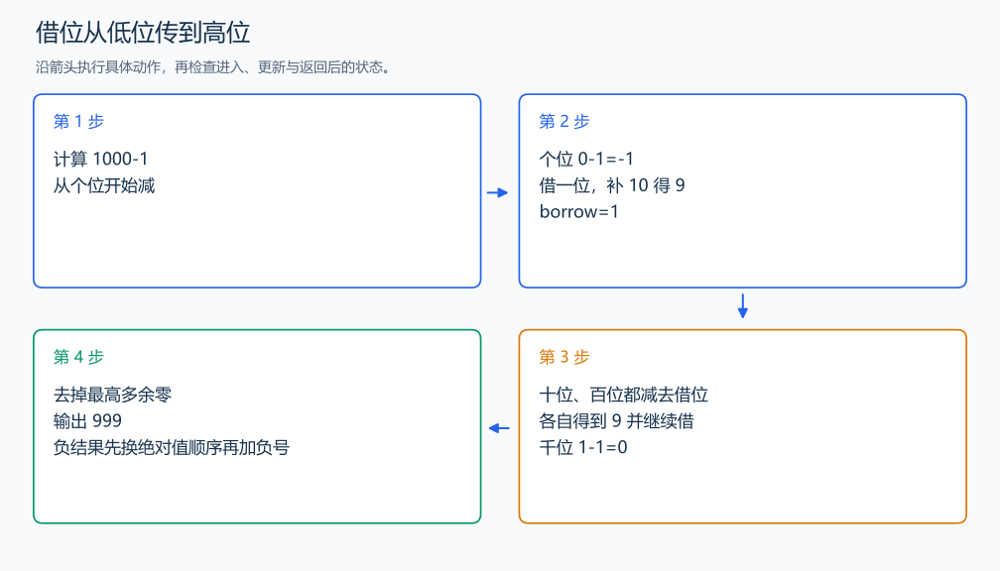

# P2142 高精度减法

[原题入口](https://www.luogu.com.cn/problem/P2142)

对应章节：四、批量输入、大整数运算与提交检查 → （二） 大整数的加减乘除。

## （一） 任务与输出目标

输出 A-B，结果可以为负。

## （二） 建模与推导

先去掉多余前导零，再按长度与字典序比较绝对值。较大的绝对值减较小的，从个位开始减去借位；当前差为负时加 10，同时向下一位借 1。若 A<B，先输出负号，再计算 B-A。绝对值为 0 时不输出负号。

## （三） 手算与过程

1000-1：个位借 1 得 9，借位穿过两个 0，结果为 999；1-1000 则为 -999。



## （四） 带注释实现

[完整源文件](../../code/P2142.cpp)

```cpp
#include <bits/stdc++.h>
using namespace std;

string normalize(string s){
    auto p=s.find_first_not_of('0');
    return p==string::npos?"0":s.substr(p); // 保留唯一的零表示。
}

int main() {
    string a,b;cin>>a>>b;a=normalize(a);b=normalize(b);
    bool negative=a.size()<b.size()||(a.size()==b.size()&&a<b);
    if(negative){cout<<'-';swap(a,b);} // 先确定符号，再做大数减小数。
    string result;int borrow=0,j=b.size()-1;
    for(int i=a.size()-1;i>=0;--i){
        int value=a[i]-'0'-borrow-(j>=0?b[j--]-'0':0);
        borrow=value<0;if(borrow)value+=10;
        result.push_back('0'+value); // 借位在下一轮扣除。
    }
    while(result.size()>1&&result.back()=='0')result.pop_back();
    reverse(result.begin(),result.end());cout<<result<<'\n';
}
```

头文件 `<bits/stdc++.h>` 汇总 GNU C++ 的常用标准库，包含本程序使用的流、容器与算法；这是序言竞赛模板中的包含方式。

## （五） 复杂度

时间 $O(n+m)$，空间 $O(n+m)$。

[返回本章题解索引](README.md) · [返回全部题号索引](../../README.md)
