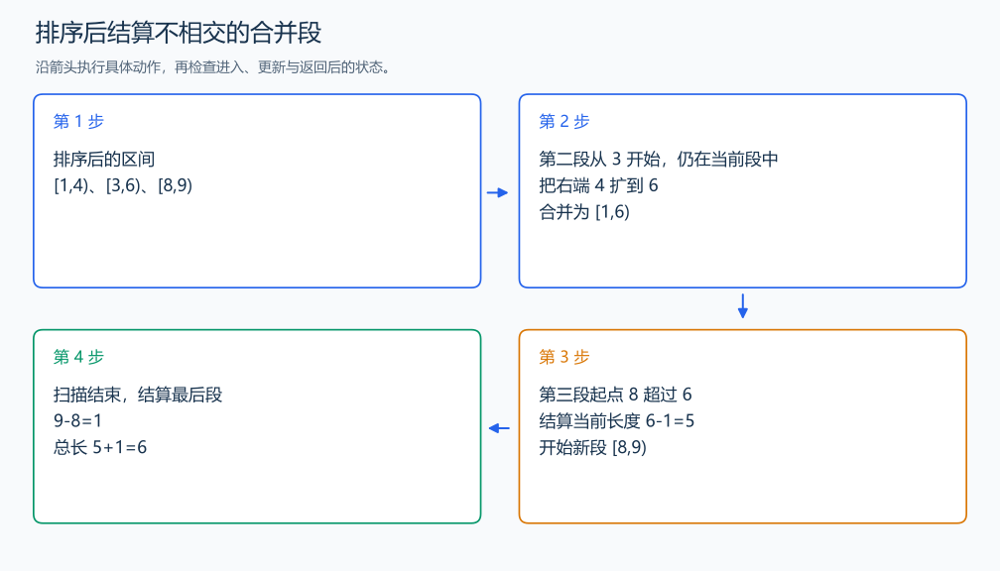

# P1496 火烧赤壁

[原题入口](https://www.luogu.com.cn/problem/P1496)

对应章节：五、数据结构与算法 → （四） 排序与离散化。

## （一） 任务与输出目标

求左闭右开区间的并集长度。

## （二） 建模与推导

按左端点排序，维护当前合并段 [l,r)。下一段起点不大于 r 时，更新右端点为较大者；起点大于 r 时，中间有空白，结算 r-l 后开始新段。长度用右端点减左端点，不加一；最后一段也要结算。

## （三） 手算与过程

[1,4)、[3,6)、[8,9) 合并为 [1,6) 与 [8,9)，长度为 6。



## （四） 带注释实现

[完整源文件](../../code/P1496.cpp)

```cpp
#include <bits/stdc++.h> // 竞赛模板中的常用标准库工具。
#define int long long   // 统一使用较大的整数类型。
#define endl '\n'       // 普通输出换行，避免逐行刷新。
using namespace std;

void solve() {
    int n; cin >> n;
    vector<pair<long long,long long>> intervals(n);
    for (auto& [l, r] : intervals) cin >> l >> r;
    sort(intervals.begin(), intervals.end());
    long long l = intervals[0].first, r = intervals[0].second, answer = 0;
    for (int i = 1; i < n; ++i) {
        auto [x, y] = intervals[i];
        if (x <= r) r = max(r, y); // 合并重叠或相接的段。
        else { answer += r - l; l = x; r = y; }
    }
    cout << answer + r - l << '\n'; // 结算最后一段。
}

signed main() {
    ios::sync_with_stdio(false); // 关闭同步，使用 cin 与 cout 完成输入输出。
    cin.tie(0), cout.tie(0);

    int T = 1; // 本题读入一组数据。
    // cin >> T; // 题目给出测试组数时开启，并在 solve 中处理一组。
    while (T--)
        solve();
}
```

头文件 `<bits/stdc++.h>` 汇总 GNU C++ 的常用标准库，包含本程序使用的流、容器与算法；这是序言竞赛模板中的包含方式。

## （五） 复杂度

时间 $O(n\log n)$，空间 $O(n)$。

[返回本章题解索引](README.md) · [返回全部题号索引](../../README.md)
