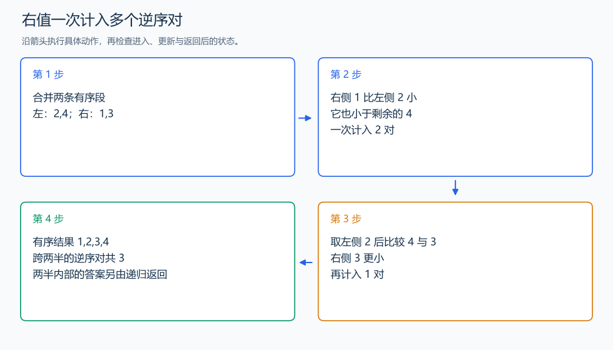

# P1908 逆序对

[原题入口](https://www.luogu.com.cn/problem/P1908)

对应章节：五、数据结构与算法 → （四） 排序与离散化。

## （一） 任务与输出目标

统计 i<j 且左值严格大于右值的位置对。

## （二） 建模与推导

递归统计左右两半，然后在有序合并中统计跨两半的对。当右侧当前值小于左侧当前值时，它也小于左侧尚未取出的所有值，一次增加那段的长度。每对只在两个位置第一次分属左右两半时被统计，不会重复。相等时先取左值，不增加答案。

## （三） 手算与过程

左半 2,4，右半 1,3：取 1 贡献 2 对，取 3 贡献 1 对，共 3。



## （四） 带注释实现

[完整源文件](../../code/P1908.cpp)

```cpp
#include <bits/stdc++.h>
#define int long long
#define endl '\n'
using namespace std;

vector<int> a, temp;

int merge_count(int l, int r) {
    if (r - l <= 1)
        return 0;
    int mid = (l + r) / 2;
    int answer = merge_count(l, mid) + merge_count(mid, r);
    int i = l, j = mid, k = l;
    while (i < mid && j < r)
        if (a[i] <= a[j])
            temp[k++] = a[i++];
        else {
            answer += mid - i;
            temp[k++] = a[j++];
        } // 计入剩余左侧值构成的对。
    while (i < mid)
        temp[k++] = a[i++];
    while (j < r)
        temp[k++] = a[j++];
    copy(temp.begin() + l, temp.begin() + r, a.begin() + l);
    return answer;
}

void solve() {
    int n;
    cin >> n;
    a.resize(n);
    temp.resize(n);
    for (int& x : a)
        cin >> x;
    cout << merge_count(0, n) << '\n';
}

signed main() {
    ios::sync_with_stdio(false); // 关闭同步，使用 cin 与 cout 完成输入输出。
    cin.tie(0), cout.tie(0);

    int T = 1; // 本题读入一组数据。
    // cin >> T; // 题目给出测试组数时开启，并在 solve 中处理一组。
    while (T--)
        solve();
}
```

## （五） 复杂度

时间 $O(n\log n)$，数组空间 $O(n)$，递归栈 $O(\log n)$。

[返回本章题解索引](README.md) · [返回全部题号索引](../../README.md)
