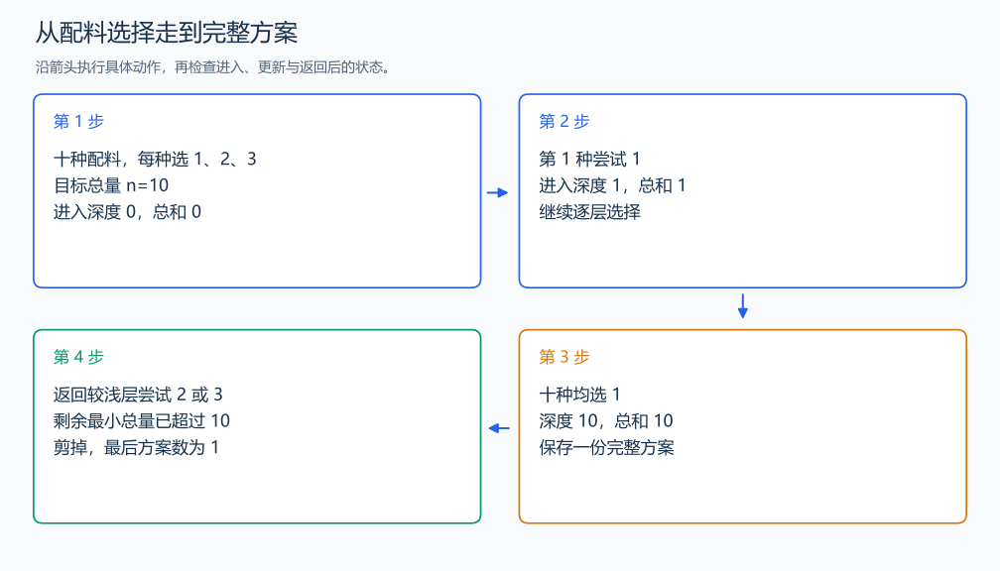

# P2089 烤鸡

[原题入口](https://www.luogu.com.cn/problem/P2089)

对应章节：五、数据结构与算法 → （二） 枚举与模拟。

## （一） 任务与输出目标

枚举十种配料取 1 到 3 克且总和为 n 的方案，按字典序输出。

## （二） 建模与推导

每层决定一种配料，依次尝试 1、2、3；十层后检查总和。较小取值的子树先处理，自然得到字典序。剩余 r 种时，后续最少再加 r，最多加 3r，达不到目标的分支可以提前结束。保存完整方案后先输出数量，再输出内容。

## （三） 手算与过程

n=10：所有配料均取 1，只有一个方案。



## （四） 带注释实现

[完整源文件](../../code/P2089.cpp)

```cpp
#include <bits/stdc++.h> // 竞赛模板中的常用标准库工具。
#define int long long   // 统一使用较大的整数类型。
#define endl '\n'       // 普通输出换行，避免逐行刷新。
using namespace std;

int target;
array<int,10> current;
vector<array<int,10>> answers;
void dfs(int depth, int sum) {
    int left = 10 - depth;
    if (sum + left > target || sum + 3 * left < target) return; // 余下配料的总量范围。
    if (depth == 10) { answers.push_back(current); return; }
    for (int x = 1; x <= 3; ++x) {
        current[depth] = x; // 本层决定一种配料。
        dfs(depth + 1, sum + x);
    }
}

void solve() {
    cin >> target;
    dfs(0, 0);
    cout << answers.size() << '\n';
    for (const auto& choice : answers) {
        for (int x : choice) cout << x << ' ';
        cout << '\n';
    }
}

signed main() {
    ios::sync_with_stdio(false); // 关闭同步，使用 cin 与 cout 完成输入输出。
    cin.tie(0), cout.tie(0);

    int T = 1; // 本题读入一组数据。
    // cin >> T; // 题目给出测试组数时开启，并在 solve 中处理一组。
    while (T--)
        solve();
}
```

头文件 `<bits/stdc++.h>` 汇总 GNU C++ 的常用标准库，包含本程序使用的流、容器与算法；这是序言竞赛模板中的包含方式。

## （五） 复杂度

枚举规模 $3^{10}$，R 个方案输出需 $O(10R)$；存储 $O(10R)$，递归深度 10。

[返回本章题解索引](README.md) · [返回全部题号索引](../../README.md)
