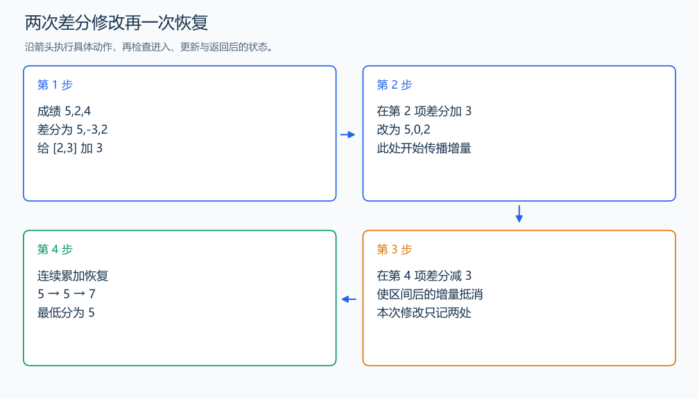

# P2367 语文成绩

[原题入口](https://www.luogu.com.cn/problem/P2367)

对应章节：序言 → 建议的自学顺序与练习；五、数据结构与算法 → （三） 前缀和与差分。

## （一） 任务与输出目标

多次给连续学生加分，最后输出最低成绩。

## （二） 建模与推导

差分 `d[i]`=`a[i]`-`a[i-1]`。给 x 到 y 加 z，在 `d[x]` 加 z，使后续前缀都增加 z；在 `d[y+1]` 减 z，使这项增量到 y 为止。所有修改完成后一次累积恢复，并更新最低分。

## （三） 手算与过程

5,2,4 的 [2,3] 加 3，变成 5,5,7，最低为 5。



## （四） 带注释实现

[完整源文件](../../code/P2367.cpp)

```cpp
#include <bits/stdc++.h>
#define int long long
#define endl '\n'
using namespace std;

void solve() {
    int n, p;
    cin >> n >> p;
    vector<int> diff(n + 2, 0);
    int last = 0;
    for (int i = 1; i <= n; ++i) {
        int x;
        cin >> x;
        diff[i] = x - last;
        last = x;
    }
    while (p--) {
        int x, y;
        int z;
        cin >> x >> y >> z;
        diff[x] += z;
        diff[y + 1] -= z;
    }
    int value = 0, answer = LLONG_MAX;
    for (int i = 1; i <= n; ++i) {
        value += diff[i]; // 前缀恢复当前学生的成绩。
        answer = min(answer, value);
    }
    cout << answer << '\n';
}

signed main() {
    ios::sync_with_stdio(false); // 关闭同步，使用 cin 与 cout 完成输入输出。
    cin.tie(0), cout.tie(0);

    int T = 1; // 本题读入一组数据。
    // cin >> T; // 题目给出测试组数时开启，并在 solve 中处理一组。
    while (T--)
        solve();
}
```

## （五） 复杂度

时间 $O(n+p)$，空间 $O(n)$。

[返回本章题解索引](README.md) · [返回全部题号索引](../../README.md)
