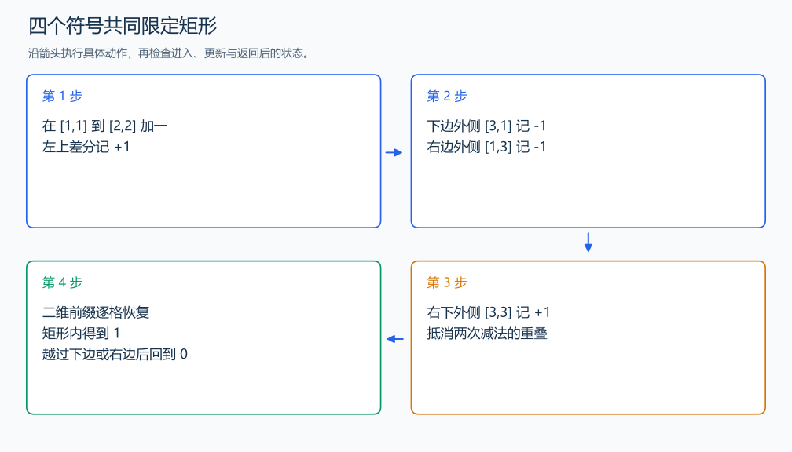

# P3397 地毯

[原题入口](https://www.luogu.com.cn/problem/P3397)

对应章节：五、数据结构与算法 → （三） 前缀和与差分。

## （一） 任务与输出目标

统计每个二维格子被给定矩形覆盖的次数。

## （二） 建模与推导

矩形左上角加 1，右边外侧和下边外侧各减 1，右下外侧加回 1，因为那里被重复扣除。二维前缀恢复后，矩形内部贡献 1、外部贡献 0；多张地毯的贡献相加。每次恢复还要减去左上前缀，消掉上方与左方的重复部分。

## （三） 手算与过程

两张地毯都覆盖右下格，该格的结果为 2。



## （四） 带注释实现

[完整源文件](../../code/P3397.cpp)

```cpp
#include <bits/stdc++.h>
using namespace std;


int main() {
    int n, m; cin >> n >> m;
    vector<vector<int>> d(n + 2, vector<int>(n + 2, 0));
    while (m--) {
        int x1, y1, x2, y2; cin >> x1 >> y1 >> x2 >> y2;
        ++d[x1][y1]; --d[x2 + 1][y1]; --d[x1][y2 + 1]; ++d[x2 + 1][y2 + 1];
    }
    for (int i = 1; i <= n; ++i) {
        for (int j = 1; j <= n; ++j) {
            d[i][j] += d[i - 1][j] + d[i][j - 1] - d[i - 1][j - 1]; // 恢复覆盖数。
            cout << d[i][j] << (j == n ? '\n' : ' ');
        }
    }
}
```

头文件 `<bits/stdc++.h>` 汇总 GNU C++ 的常用标准库，包含本程序使用的流、容器与算法；这是序言竞赛模板中的包含方式。

## （五） 复杂度

时间 $O(m+n^2)$，空间 $O(n^2)$。

[返回本章题解索引](README.md) · [返回全部题号索引](../../README.md)
