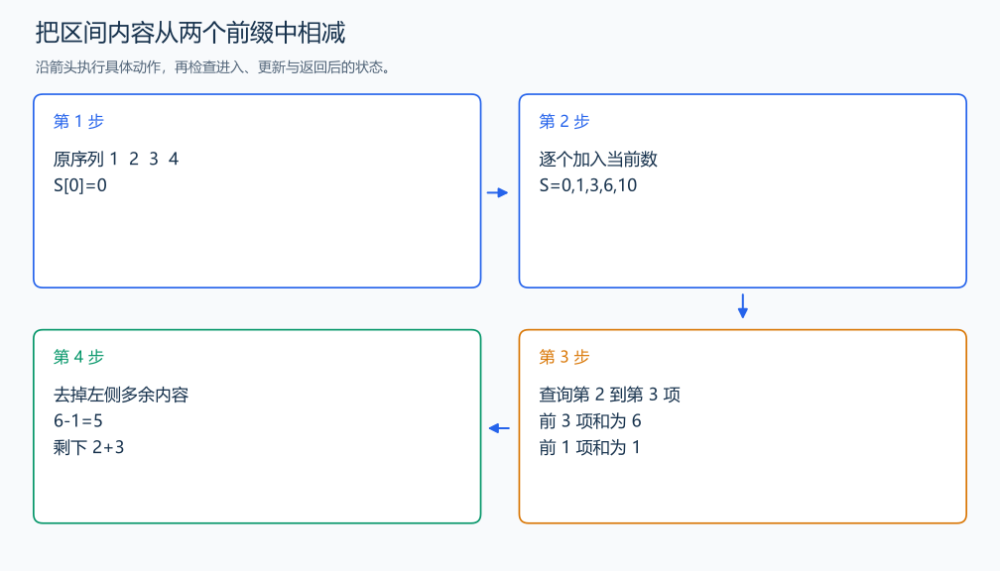

# P8218 求区间和

[原题入口](https://www.luogu.com.cn/problem/P8218)

对应章节：序言 → 建议的自学顺序与练习；五、数据结构与算法 → （三） 前缀和与差分。

## （一） 任务与输出目标

回答多次闭区间求和询问。

## （二） 建模与推导

`S[i]` 保存前 i 项之和，`S[0]`=0。前 r 项去掉前 l-1 项，剩下的恰好是 l 到 r，因此答案为 `S[r]`-`S[l-1]`。预处理时每项加一次，查询时只做一次减法。

## （三） 手算与过程

1,2,3,4 的前缀为 0,1,3,6,10；查询 [2,3] 得 6-1=5。



## （四） 带注释实现

[完整源文件](../../code/P8218.cpp)

```cpp
#include <bits/stdc++.h> // 竞赛模板中的常用标准库工具。
#define int long long   // 统一使用较大的整数类型。
#define endl '\n'       // 普通输出换行，避免逐行刷新。
using namespace std;

void solve() {
    int n; cin >> n;
    vector<long long> sum(n + 1, 0);
    for (int i = 1; i <= n; ++i) { long long x; cin >> x; sum[i] = sum[i - 1] + x; }
    int q; cin >> q;
    while (q--) {
        int l, r; cin >> l >> r;
        cout << sum[r] - sum[l - 1] << '\n'; // 去掉左端点之前的前缀。
    }
}

signed main() {
    ios::sync_with_stdio(false); // 关闭同步，使用 cin 与 cout 完成输入输出。
    cin.tie(0), cout.tie(0);

    int T = 1; // 本题读入一组数据。
    // cin >> T; // 题目给出测试组数时开启，并在 solve 中处理一组。
    while (T--)
        solve();
}
```

头文件 `<bits/stdc++.h>` 汇总 GNU C++ 的常用标准库，包含本程序使用的流、容器与算法；这是序言竞赛模板中的包含方式。

## （五） 复杂度

时间 $O(n+q)$，空间 $O(n)$。

[返回本章题解索引](README.md) · [返回全部题号索引](../../README.md)
