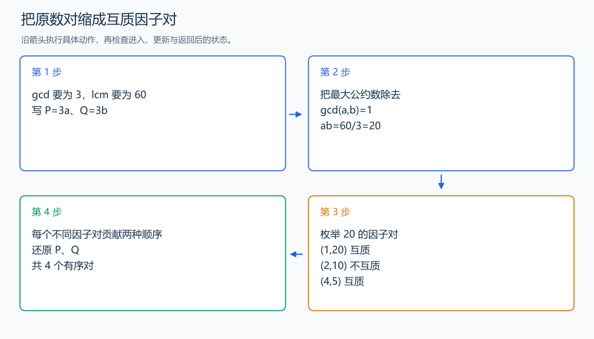

# P1029 最大公约数和最小公倍数问题

[原题入口](https://www.luogu.com.cn/problem/P1029)

对应章节：一、C++ 语法基础 → （十五） STL：容器、迭代器与算法；五、数据结构与算法 → （五） 基础数论。

## （一） 任务与输出目标

统计 gcd(P,Q)=x 且 lcm(P,Q)=y 的有序正整数对。

## （二） 建模与推导

把 P、Q 都除以 x，写为 P=xa、Q=xb。于是 gcd(a,b)=1，并且 ab=y/x。先确认 y 能被 x 整除，再枚举 y/x 的因子 a，令 b=(y/x)/a；互质的因子对贡献两个顺序，a=b 时只贡献一个。这样避免直接枚举 P、Q 的二维组合。

## （三） 手算与过程

x=3、y=60，商 20 的互质因子对为 (1,20)、(4,5)，还原后共 4 个有序对。



## （四） 带注释实现

[完整源文件](../../code/P1029.cpp)

```cpp
#include <bits/stdc++.h>
using namespace std;


int main() {
    long long x, y; cin >> x >> y;
    if (y % x != 0) { cout << 0 << '\n'; return 0; }
    long long product = y / x, answer = 0;
    for (long long a = 1; a * a <= product; ++a) {
        if (product % a != 0) continue;
        long long b = product / a;
        if (gcd(a, b) == 1) answer += (a == b ? 1 : 2); // 还原成 P、Q 时保留两种顺序。
    }
    cout << answer << '\n';
}
```

头文件 `<bits/stdc++.h>` 汇总 GNU C++ 的常用标准库，包含本程序使用的流、容器与算法；这是序言竞赛模板中的包含方式。

## （五） 复杂度

时间 $O(\sqrt{y/x}\log(y/x))$，额外空间 $O(1)$。

[返回本章题解索引](README.md) · [返回全部题号索引](../../README.md)
