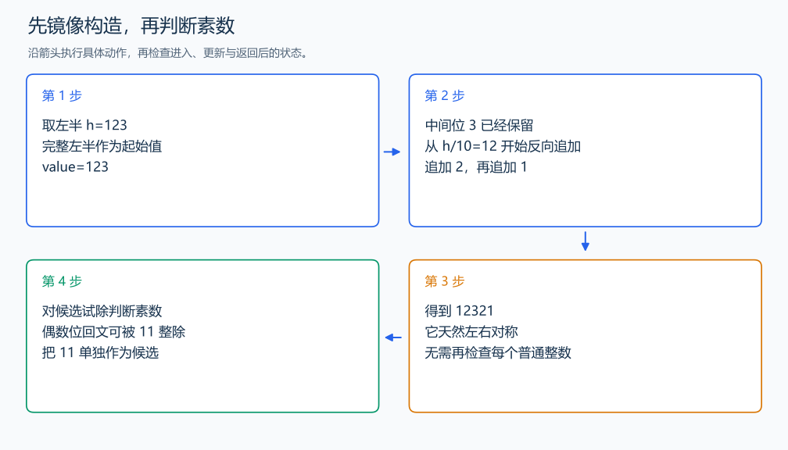

# P1217 回文质数

[原题入口](https://www.luogu.com.cn/problem/P1217)

对应章节：五、数据结构与算法 → （九） 双指针与滑动窗口（尺取法）。

## （一） 任务与输出目标

输出区间内同时为回文数和质数的整数。

## （二） 建模与推导

先构造回文，减少候选。用 h 作为左半部分，去掉其中的中间位再反向追加，得到奇数位回文；例如 h=123 得到 12321。偶数位回文能被 11 整除，因为奇偶位置的数字和相等，所以质数中只需单独补入 11。对候选用试除判断质数，排序后输出。

## （三） 手算与过程

5 到 20 内的回文质数为 5、7、11；单个数码本身也是回文。



## （四） 带注释实现

[完整源文件](../../code/P1217.cpp)

```cpp
#include <bits/stdc++.h>
#define int long long
#define endl '\n'
using namespace std;

void solve() {
    int l, r;
    cin >> l >> r;
    vector<int> candidates{11};
    for (int half = 1;; ++half) {
        int value = half;
        for (int x = half / 10; x > 0; x /= 10)
            value = value * 10 + x % 10; // 镜像追加。
        if (value > r)
            break;
        if (value >= l)
            candidates.push_back((int)value);
    }
    sort(candidates.begin(), candidates.end());
    for (int x : candidates) {
        if (x < l || x > r || x < 2)
            continue;
        bool prime = true;
        for (int d = 2; 1LL * d * d <= x; ++d)
            if (x % d == 0) {
                prime = false;
                break;
            }
        if (prime)
            cout << x << '\n';
    }
}

signed main() {
    ios::sync_with_stdio(false); // 关闭同步，使用 cin 与 cout 完成输入输出。
    cin.tie(0), cout.tie(0);

    int T = 1; // 本题读入一组数据。
    // cin >> T; // 题目给出测试组数时开启，并在 solve 中处理一组。
    while (T--)
        solve();
}
```

## （五） 复杂度

K 个回文候选，试除上界 $O(K\sqrt r)$，构造 $O(K\log r)$，空间 $O(K)$。

[返回本章题解索引](README.md) · [返回全部题号索引](../../README.md)
