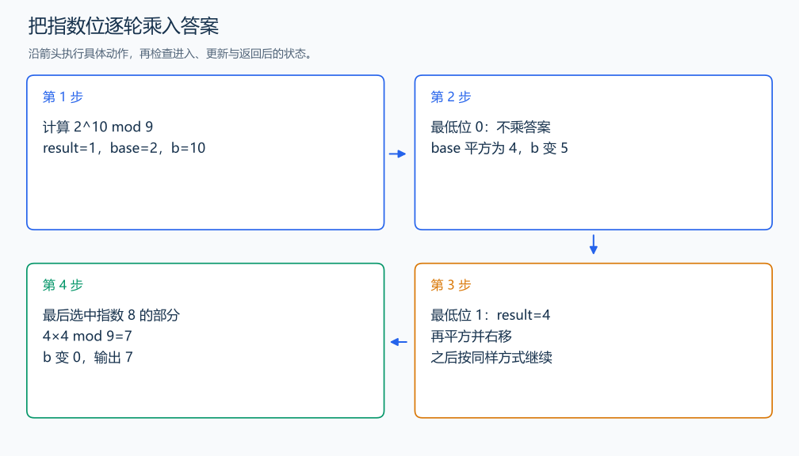

# P1226 快速幂

[原题入口](https://www.luogu.com.cn/problem/P1226)

对应章节：序言 → 建议的自学顺序与练习；五、数据结构与算法 → （六） 快速幂。

## （一） 任务与输出目标

计算 a 的 b 次方模 p，并按指定格式输出。

## （二） 建模与推导

用 b 的二进制表示拆分指数。当前 base 对应某个 2 的幂次；若 b 的最低位为 1，就把这一项乘进 result，然后 base 平方、b 右移。每轮保持 result×base^b 与原来的 a^b 同余。保存原指数用于输出，不能打印已经被移到 0 的 b。

## （三） 手算与过程

2^10 模 9：10=8+2，把对应的幂相乘，结果为 7。



## （四） 带注释实现

[完整源文件](../../code/P1226.cpp)

```cpp
#include <bits/stdc++.h> // 竞赛模板中的常用标准库工具。
#define int long long   // 统一使用较大的整数类型。
#define endl '\n'       // 普通输出换行，避免逐行刷新。
using namespace std;

void solve() {
    long long a, b, p; cin >> a >> b >> p;
    long long original = b, base = a % p, result = 1 % p;
    while (b > 0) {
        if (b & 1) result = result * base % p; // 选择当前二进制位对应的幂。
        base = base * base % p;
        b >>= 1; // 下一轮处理更高的指数位。
    }
    cout << a << '^' << original << " mod " << p << '=' << result << '\n';
}

signed main() {
    ios::sync_with_stdio(false); // 关闭同步，使用 cin 与 cout 完成输入输出。
    cin.tie(0), cout.tie(0);

    int T = 1; // 本题读入一组数据。
    // cin >> T; // 题目给出测试组数时开启，并在 solve 中处理一组。
    while (T--)
        solve();
}
```

头文件 `<bits/stdc++.h>` 汇总 GNU C++ 的常用标准库，包含本程序使用的流、容器与算法；这是序言竞赛模板中的包含方式。

## （五） 复杂度

时间 $O(\log(b+1))$，额外空间 $O(1)$。

[返回本章题解索引](README.md) · [返回全部题号索引](../../README.md)
