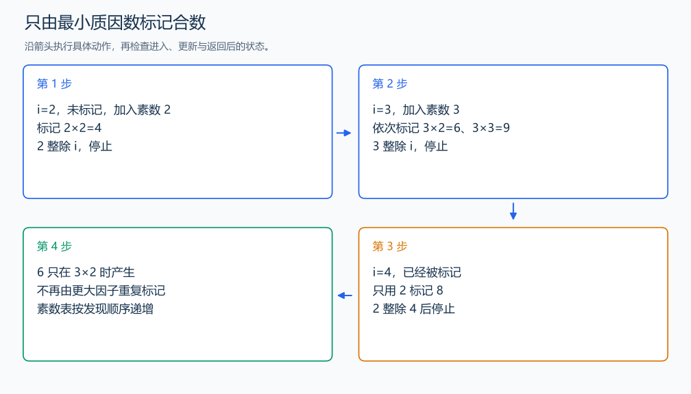

# P3383 线性筛素数

[原题入口](https://www.luogu.com.cn/problem/P3383)

对应章节：五、数据结构与算法 → （五） 基础数论。

## （一） 任务与输出目标

预处理不超过 n 的素数，回答第 k 个素数。

## （二） 建模与推导

从小到大扫描 i，尚未被标记时它是素数。用已知素数 p 标记 i×p；当 p 整除 i 时结束当前内层循环。这样每个合数仅由它的最小质因数标记一次：若继续使用更大的 p，i 中已有更小因子，会产生重复。素数数组按发现顺序递增，第 k 个对应下标 k-1。

## （三） 手算与过程

n=10，发现 2、3、5、7；6 在 i=3、p=2 时标记，之后不会重复从 i=2、p=3 产生。



## （四） 带注释实现

[完整源文件](../../code/P3383.cpp)

```cpp
#include <bits/stdc++.h>
using namespace std;


int main() {
    ios::sync_with_stdio(false); cin.tie(nullptr);
    int n, q; cin >> n >> q;
    vector<bool> composite(n + 1, false); // 位压缩存储大规模筛标记。
    vector<int> primes;
    for (int i = 2; i <= n; ++i) {
        if (!composite[i]) primes.push_back(i);
        for (int p : primes) {
            if (p > n / i) break; // 先比较商，避免 i*p 的中间溢出。
            composite[i * p] = true;
            if (i % p == 0) break; // 每个合数只由最小质因数产生。
        }
    }
    while (q--) { int k; cin >> k; cout << primes[k - 1] << '\n'; }
}
```

头文件 `<bits/stdc++.h>` 汇总 GNU C++ 的常用标准库，包含本程序使用的流、容器与算法；这是序言竞赛模板中的包含方式。

## （五） 复杂度

筛时间 $O(n)$，查询 $O(q)$；位标记约 $(n+1)/8$ 字节，素数表另占 $O(\pi(n))$ 个整数。

[返回本章题解索引](README.md) · [返回全部题号索引](../../README.md)
