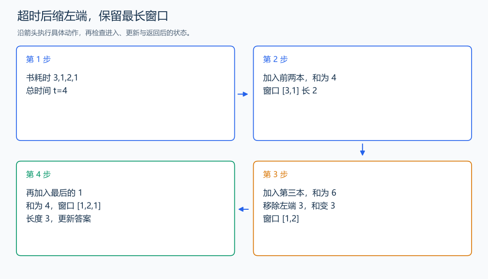

# CF279-B Books

[原题入口](https://codeforces.com/problemset/problem/279/B)

对应章节：五、数据结构与算法 → （九） 双指针与滑动窗口（尺取法）。

## （一） 任务与输出目标

在总阅读时间不超过 t 的连续片段中，最大化书的数量。

## （二） 建模与推导

右端每次加入一本书。超时就依次移走左端，直到重新可读。所有时间为正，向右加入只会增加总和，向左移走只会减少总和；删掉的左端以后也不会因加入更多书重新变得可行。每个右端下剩下的最靠左可行起点给出最长片段。

## （三） 手算与过程

3,1,2,1，t=4：第一个超时窗口缩小后为 1,2；继续加入 1，得到长度 3。



## （四） 带注释实现

[完整源文件](../../code/CF279-B.cpp)

```cpp
#include <bits/stdc++.h> // 竞赛模板中的常用标准库工具。
#define int long long   // 统一使用较大的整数类型。
#define endl '\n'       // 普通输出换行，避免逐行刷新。
using namespace std;

void solve() {
    int n; long long t; cin >> n >> t;
    vector<int> a(n); for (int& x : a) cin >> x;
    long long sum = 0;
    int left = 0, answer = 0;
    for (int right = 0; right < n; ++right) {
        sum += a[right];
        while (sum > t) sum -= a[left++]; // 缩小到能够读完的窗口。
        answer = max(answer, right - left + 1);
    }
    cout << answer << '\n';
}

signed main() {
    ios::sync_with_stdio(false); // 关闭同步，使用 cin 与 cout 完成输入输出。
    cin.tie(0), cout.tie(0);

    int T = 1; // 本题读入一组数据。
    // cin >> T; // 题目给出测试组数时开启，并在 solve 中处理一组。
    while (T--)
        solve();
}
```

头文件 `<bits/stdc++.h>` 汇总 GNU C++ 的常用标准库，包含本程序使用的流、容器与算法；这是序言竞赛模板中的包含方式。

## （五） 复杂度

两端各至多移动 n 次，时间 $O(n)$，空间 $O(n)$。

[返回本章题解索引](README.md) · [返回全部题号索引](../../README.md)
