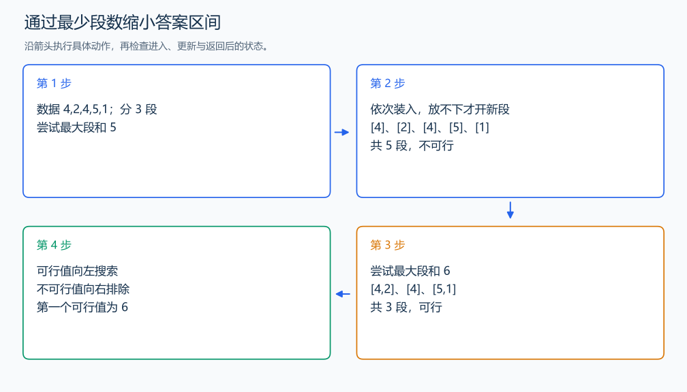

# P1182 数列分段 Section II

[原题入口](https://www.luogu.com.cn/problem/P1182)

对应章节：序言 → 建议的自学顺序与练习；三、解题方法论：从题意到代码 → （七） 把最优化改成可行性判断；三、解题方法论：从题意到代码 → （九） 建模与推导中的典型反例；五、数据结构与算法 → （十） 二分与三分搜索。

## （一） 任务与输出目标

分成 M 个连续段，使最大段和最小。

## （二） 建模与推导

尝试给段和一个上限 limit，从左到右尽量装进当前段；放不下才另开一段。提前切段不能让本段覆盖更多元素，所以这个扫描得到满足 limit 的最少段数。段数不超过 M 就可行；不足 M 时可以把段继续拆开，非负数保证拆分不增大段和。limit 增大不会让已有分法失效，因此二分第一个可行值。下界为最大单项，上界为总和。

## （三） 手算与过程

4,2,4,5,1 分三段：上限 5 需五段；上限 6 可分 [4,2]、[4]、[5,1]，答案 6。



## （四） 带注释实现

[完整源文件](../../code/P1182.cpp)

```cpp
#include <bits/stdc++.h> // 竞赛模板中的常用标准库工具。
#define int long long   // 统一使用较大的整数类型。
#define endl '\n'       // 普通输出换行，避免逐行刷新。
using namespace std;

void solve() {
    int n, m; cin >> n >> m;
    vector<long long> a(n); long long low = 0, high = 0;
    for (auto& x : a) { cin >> x; low = max(low, x); high += x; }
    auto possible = [&](long long limit) {
        int groups = 1; long long sum = 0;
        for (long long x : a) {
            if (sum + x > limit) { ++groups; sum = x; } // 当前段放不下，开始下一段。
            else sum += x;
        }
        return groups <= m;
    };
    while (low < high) {
        long long mid = low + (high - low) / 2;
        if (possible(mid)) high = mid; else low = mid + 1;
    }
    cout << low << '\n';
}

signed main() {
    ios::sync_with_stdio(false); // 关闭同步，使用 cin 与 cout 完成输入输出。
    cin.tie(0), cout.tie(0);

    int T = 1; // 本题读入一组数据。
    // cin >> T; // 题目给出测试组数时开启，并在 solve 中处理一组。
    while (T--)
        solve();
}
```

头文件 `<bits/stdc++.h>` 汇总 GNU C++ 的常用标准库，包含本程序使用的流、容器与算法；这是序言竞赛模板中的包含方式。

## （五） 复杂度

总和 S，时间 $O(n\log(S+1))$，空间 $O(n)$。

[返回本章题解索引](README.md) · [返回全部题号索引](../../README.md)
