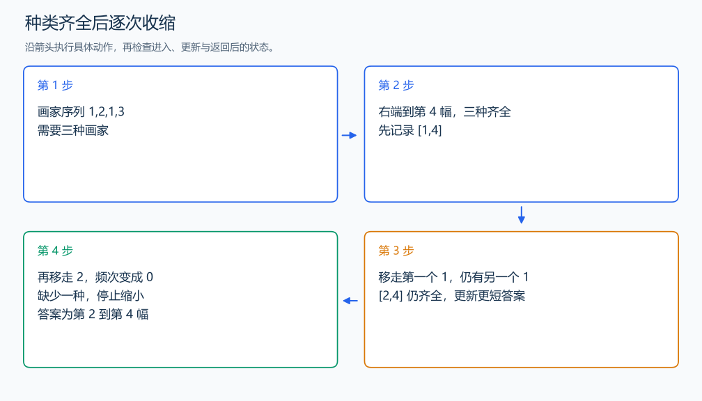

# P1638 逛画展

[原题入口](https://www.luogu.com.cn/problem/P1638)

对应章节：五、数据结构与算法 → （九） 双指针与滑动窗口（尺取法）。

## （一） 任务与输出目标

找出包含全部 m 位画家作品的最短连续片段，同样长时选左端最小者。

## （二） 建模与推导

右端扩张时统计画家频次，某个画家由 0 变 1 时种类加一。全部出现后尝试缩左端：每次先记录当前可行片段，再移除左侧作品；某个画家频次变 0 时停止缩小。只在长度严格更短时更新答案，因此从左到右遇到的较早左端在同长度下会被保留。

## （三） 手算与过程

1,2,1,3，m=3：先得到 [1,4]，移除第一幅后 [2,4] 仍完整，再移除 2 就缺一种，答案为 2 4。



## （四） 带注释实现

[完整源文件](../../code/P1638.cpp)

```cpp
#include <bits/stdc++.h>
#define int long long
#define endl '\n'
using namespace std;

void solve() {
    int n, m;
    cin >> n >> m;
    vector<int> a(n), count(m + 1, 0);
    for (int& x : a)
        cin >> x;
    int left = 0, kinds = 0, best = n + 1, x = 0, y = 0;
    for (int right = 0; right < n; ++right) {
        if (count[a[right]]++ == 0)
            ++kinds;
        while (kinds == m) {
            if (right - left + 1 < best) {
                best = right - left + 1;
                x = left;
                y = right;
            }
            if (--count[a[left++]] == 0)
                --kinds; // 缺少一种画家后停止缩小。
        }
    }
    cout << x + 1 << ' ' << y + 1 << '\n';
}

signed main() {
    ios::sync_with_stdio(false); // 关闭同步，使用 cin 与 cout 完成输入输出。
    cin.tie(0), cout.tie(0);

    int T = 1; // 本题读入一组数据。
    // cin >> T; // 题目给出测试组数时开启，并在 solve 中处理一组。
    while (T--)
        solve();
}
```

## （五） 复杂度

时间 $O(n+m)$，空间 $O(n+m)$。

[返回本章题解索引](README.md) · [返回全部题号索引](../../README.md)
