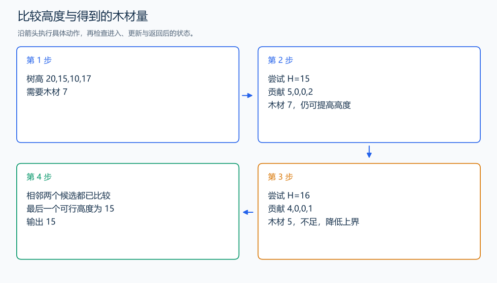

# P1873 砍树

[原题入口](https://www.luogu.com.cn/problem/P1873)

对应章节：三、解题方法论：从题意到代码 → （七） 把最优化改成可行性判断；五、数据结构与算法 → （十） 二分与三分搜索。

## （一） 任务与输出目标

找出能取得至少 M 木材的最高整数锯片高度。

## （二） 建模与推导

固定高度 H，每棵树贡献 max(0,height-H)。升高锯片时每棵贡献不增，所以足够木材的高度是一段连续前缀。二分最后一个可行高度：中点可行就保留中点及右侧，不可行就删掉中点及右侧。取上中点，使只有两个候选时仍能推进。

## （三） 手算与过程

20,15,10,17，需要 7：H=15 得 5+2=7；H=16 只得 4+1=5，答案 15。



## （四） 带注释实现

[完整源文件](../../code/P1873.cpp)

```cpp
#include <bits/stdc++.h>
using namespace std;


int main() {
    int n; long long need; cin >> n >> need;
    vector<long long> a(n); long long low = 0, high = 0;
    for (auto& x : a) { cin >> x; high = max(high, x); }
    while (low < high) {
        long long mid = low + (high - low + 1) / 2, wood = 0;
        for (long long x : a) if (x > mid) wood += x - mid; // 累加锯下的部分。
        if (wood >= need) low = mid; else high = mid - 1;
    }
    cout << low << '\n';
}
```

头文件 `<bits/stdc++.h>` 汇总 GNU C++ 的常用标准库，包含本程序使用的流、容器与算法；这是序言竞赛模板中的包含方式。

## （五） 复杂度

最高树高 H，时间 $O(n\log(H+1))$，空间 $O(n)$。

[返回本章题解索引](README.md) · [返回全部题号索引](../../README.md)
