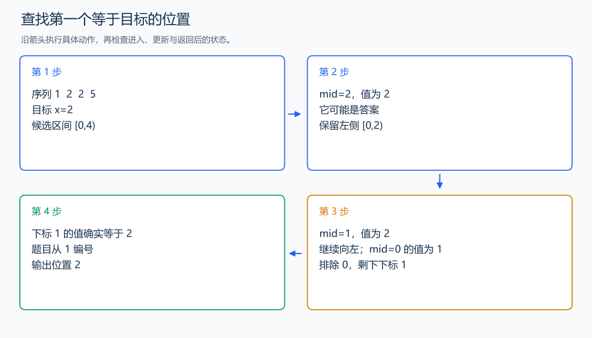

# P2249 查找

[原题入口](https://www.luogu.com.cn/problem/P2249)

对应章节：一、C++ 语法基础 → （十五） STL：容器、迭代器与算法；五、数据结构与算法 → （十） 二分与三分搜索。

## （一） 任务与输出目标

在非降序列中查询一个值第一次出现的位置，位置从 1 编号，找不到输出 -1。

## （二） 建模与推导

把目标设为第一个不小于 x 的位置。中点值小于 x 时，中点及其左侧都可以排除；否则保留中点并继续向左缩小。循环后再检查找到的位置是否真的等于 x，避免把更大的值当作命中。lower_bound 正好完成这项查找。

## （三） 手算与过程

序列 `1 2 2 5`：查 2 返回第 2 位，查 3 找到候选 5，复核后输出 -1。



## （四） 带注释实现

[完整源文件](../../code/P2249.cpp)

```cpp
#include <bits/stdc++.h>
#define int long long
#define endl '\n'
using namespace std;

void solve() {
    int n, q;
    cin >> n >> q;
    vector<int> a(n);
    for (int& x : a)
        cin >> x;
    while (q--) {
        int x;
        cin >> x;
        auto it = lower_bound(a.begin(), a.end(), x); // 第一个不小于 x 的元素。
        int answer = (it != a.end() && *it == x) ? static_cast<int>(it - a.begin()) + 1 : -1;
        cout << answer << ' ';
    }
    cout << '\n';
}

signed main() {
    ios::sync_with_stdio(false); // 关闭同步，使用 cin 与 cout 完成输入输出。
    cin.tie(0), cout.tie(0);

    int T = 1; // 本题读入一组数据。
    // cin >> T; // 题目给出测试组数时开启，并在 solve 中处理一组。
    while (T--)
        solve();
}
```

## （五） 复杂度

预存输入 $O(n)$，q 次查询 $O(q\log n)$，空间 $O(n)$。

[返回本章题解索引](README.md) · [返回全部题号索引](../../README.md)
