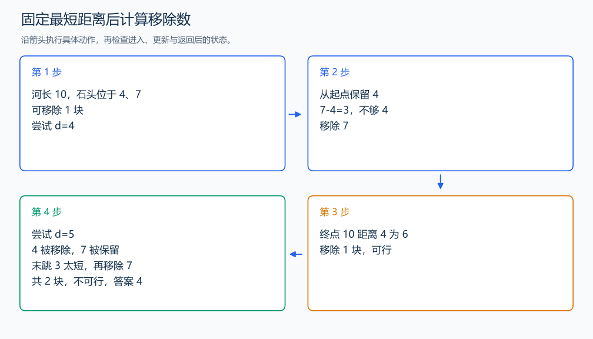

# P2678 跳石头

[原题入口](https://www.luogu.com.cn/problem/P2678)

对应章节：五、数据结构与算法 → （十） 二分与三分搜索。

## （一） 任务与输出目标

至多移除 M 块中间石头，使最短跳跃距离尽可能大。

## （二） 建模与推导

判定最短距离 d：保留起点后，遇到与上个保留点距离小于 d 的中间石头就移除，否则保留。保留更靠前的可行点，留给后续的距离更大。最后若终点离上个保留点太近，删掉最后一块保留的中间石头即可，前一跳会与这段合并；计数再加一。移除数不超过 M 就可行。d 越大要求越严格，所以二分最后一个可行 d。

## （三） 手算与过程

河长 10，中间石头 4、7，移除一块：删去 7 后跳 4、6，最短为 4；要求 5 时需删两块。



## （四） 带注释实现

[完整源文件](../../code/P2678.cpp)

```cpp
#include <bits/stdc++.h>
using namespace std;


int main() {
    long long length; int n, m; cin >> length >> n >> m;
    vector<long long> a(n); for (auto& x : a) cin >> x;
    auto possible = [&](long long distance) {
        long long last = 0; int removed = 0;
        for (long long x : a) {
            if (x - last < distance) ++removed;
            else last = x; // 保留最靠前的可行落点。
        }
        if (length - last < distance) ++removed; // 合并最后一次跳跃，移除之前的中间点。
        return removed <= m;
    };
    long long low = 0, high = length;
    while (low < high) {
        long long mid = low + (high - low + 1) / 2;
        if (possible(mid)) low = mid; else high = mid - 1;
    }
    cout << low << '\n';
}
```

头文件 `<bits/stdc++.h>` 汇总 GNU C++ 的常用标准库，包含本程序使用的流、容器与算法；这是序言竞赛模板中的包含方式。

## （五） 复杂度

时间 $O(n\log(L+1))$，空间 $O(n)$。

[返回本章题解索引](README.md) · [返回全部题号索引](../../README.md)
