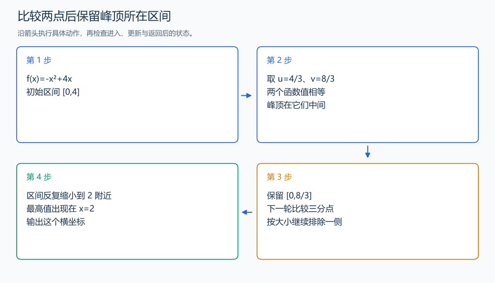

# P3382 三分

[原题入口](https://www.luogu.com.cn/problem/P3382)

对应章节：五、数据结构与算法 → （十） 二分与三分搜索。

## （一） 任务与输出目标

在题目给出的先增后减区间中求多项式的最高点位置。

## （二） 建模与推导

取区间的三分点 u、v。f(u)<f(v) 时，最高点不会在 u 左侧，否则从峰顶到 v 应当递减，与两个点的大小相矛盾；反向比较同理排除 v 右侧。每轮缩掉约三分之一。多项式求值用 Horner 法，把最高次系数逐步“乘 x，再加下一项”。

## （三） 手算与过程

f(x)=-x^2+4x，在 [0,4] 的峰顶为 2；比较两侧三分点，区间逐轮靠近 2。



## （四） 带注释实现

[完整源文件](../../code/P3382.cpp)

```cpp
#include <bits/stdc++.h> // 竞赛模板中的常用标准库工具。
#define int long long   // 统一使用较大的整数类型。
#define endl '\n'       // 普通输出换行，避免逐行刷新。
using namespace std;

void solve() {
    int n; long double l, r; cin >> n >> l >> r;
    vector<long double> a(n + 1); for (auto& x : a) cin >> x;
    auto value = [&](long double x) {
        long double y = 0;
        for (long double coefficient : a) y = y * x + coefficient; // Horner 逐项求值。
        return y;
    };
    for (int step = 0; step < 200; ++step) {
        long double u = l + (r - l) / 3, v = r - (r - l) / 3;
        if (value(u) < value(v)) l = u; else r = v; // 保留含峰顶的部分。
    }
    cout << fixed << setprecision(8) << (l + r) / 2 << '\n';
}

signed main() {
    ios::sync_with_stdio(false); // 关闭同步，使用 cin 与 cout 完成输入输出。
    cin.tie(0), cout.tie(0);

    int T = 1; // 本题读入一组数据。
    // cin >> T; // 题目给出测试组数时开启，并在 solve 中处理一组。
    while (T--)
        solve();
}
```

头文件 `<bits/stdc++.h>` 汇总 GNU C++ 的常用标准库，包含本程序使用的流、容器与算法；这是序言竞赛模板中的包含方式。

## （五） 复杂度

迭代次数 I，时间 $O(IN)$，空间 $O(N)$。

[返回本章题解索引](README.md) · [返回全部题号索引](../../README.md)
