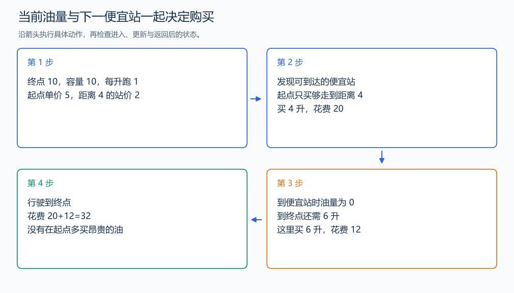

# P1016 旅行家的预算

[原题入口](https://www.luogu.com.cn/problem/P1016)

对应章节：五、数据结构与算法 → （十一） 贪心算法。

## （一） 任务与输出目标

沿途按价格买油，油箱容量有限，求到达终点的最小费用。

## （二） 建模与推导

在当前站先找油箱可达范围内的第一家更便宜站；只买够开到它的油，多买的油都能移到那家便宜站购买，减少费用。若没有更便宜站，则当前价不高于可达站，应尽量在这里买油，并驶向可达范围内最便宜的一家；目标油量为满箱或到终点所需量。先把终点加入为价格 0 的站，使到终点后不再买油。相邻位置超过满箱行驶距离时输出 No Solution。相同位置的站合并，保留较低价格。

## （三） 手算与过程

终点距离 10，容量 10，每升跑 1，起点价 5，距离 4 处价 2：起点买 4 升花 20，到站再买 6 升花 12，总计 32。



## （四） 带注释实现

[完整源文件](../../code/P1016.cpp)

```cpp
#include <bits/stdc++.h>
#define int long long
#define endl '\n'
using namespace std;

void solve() {
    double distance, capacity, per, initial;
    int n;
    cin >> distance >> capacity >> per >> initial >> n;
    vector<pair<double, double>> raw{{0, initial}, {distance, 0}};
    while (n--) {
        double d, p;
        cin >> d >> p;
        raw.emplace_back(d, p);
    }
    sort(raw.begin(), raw.end());
    vector<pair<double, double>> station;
    for (auto x : raw)
        if (!station.empty() && abs(station.back().first - x.first) < 1e-9)
            station.back().second = min(station.back().second, x.second);
        else
            station.push_back(x);
    if (distance == 0) {
        cout << "0.00\n";
        return;
    }
    if (capacity == 0 || per == 0) {
        cout << "No Solution\n";
        return;
    }
    double fuel = 0, answer = 0;
    for (int i = 0; i + 1 < (int)station.size();) {
        int cheaper = -1, cheapest = -1;
        for (int j = i + 1; j < (int)station.size(); ++j) {
            if (station[j].first - station[i].first > capacity * per + 1e-9)
                break;
            if (cheapest == -1 || station[j].second < station[cheapest].second)
                cheapest = j;
            if (station[j].second < station[i].second) {
                cheaper = j;
                break;
            }
        }
        if (cheapest == -1) {
            cout << "No Solution\n";
            return;
        }
        int next = cheaper == -1 ? cheapest : cheaper;
        double required = (station[next].first - station[i].first) / per;
        double target =
            cheaper == -1 ? min(capacity, (distance - station[i].first) / per) : required;
        double buy = max(0.0, target - fuel); // 已有油量保留，仅补足需要的部分。
        answer += buy * station[i].second;
        fuel += buy - required;
        i = next;
    }
    cout << fixed << setprecision(2) << answer << '\n';
}

signed main() {
    ios::sync_with_stdio(false); // 关闭同步，使用 cin 与 cout 完成输入输出。
    cin.tie(0), cout.tie(0);

    int T = 1; // 本题读入一组数据。
    // cin >> T; // 题目给出测试组数时开启，并在 solve 中处理一组。
    while (T--)
        solve();
}
```

## （五） 复杂度

N 个油站，排序 $O(N\log N)$，逐站寻找上界 $O(N^2)$，空间 $O(N)$。

[返回本章题解索引](README.md) · [返回全部题号索引](../../README.md)
