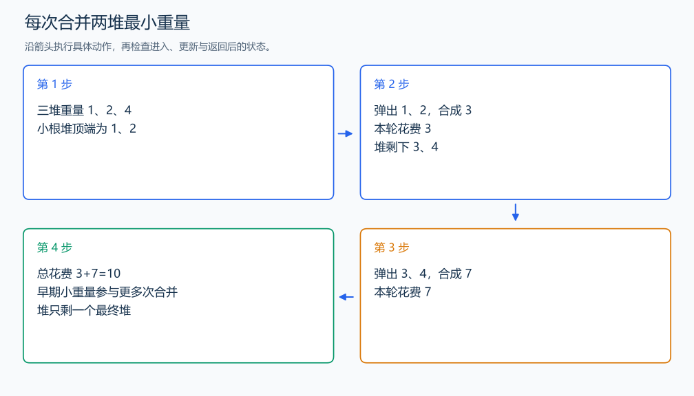

# P1090 合并果子

[原题入口](https://www.luogu.com.cn/problem/P1090)

对应章节：一、C++ 语法基础 → （十五） STL：容器、迭代器与算法；五、数据结构与算法 → （十一） 贪心算法。

## （一） 任务与输出目标

每次合并两堆的花费为重量之和，求全部合并的最小花费。

## （二） 建模与推导

每片果子的重量会在从叶子到最终堆的每次合并中计费，总代价是重量×叶深的总和。在一棵最优合并树里，可以把最小的两个重量换到最深的一对兄弟叶子，总代价不会增加。把它们合并成一个新重量后，剩下的问题形式相同，因此反复合并最小两堆。小根堆负责选取。

## （三） 手算与过程

1,2,4：先合 1+2 花 3，再合 3+4 花 7，总计 10；先合 2+4 则花 6+7=13。



## （四） 带注释实现

[完整源文件](../../code/P1090.cpp)

```cpp
#include <bits/stdc++.h> // 竞赛模板中的常用标准库工具。
#define int long long   // 统一使用较大的整数类型。
#define endl '\n'       // 普通输出换行，避免逐行刷新。
using namespace std;

void solve() {
    int n; cin >> n;
    priority_queue<long long, vector<long long>, greater<long long>> heap;
    while (n--) { long long x; cin >> x; heap.push(x); }
    long long answer = 0;
    while (heap.size() > 1) {
        long long a = heap.top(); heap.pop();
        long long b = heap.top(); heap.pop();
        answer += a + b; heap.push(a + b); // 新堆将参加后续合并。
    }
    cout << answer << '\n';
}

signed main() {
    ios::sync_with_stdio(false); // 关闭同步，使用 cin 与 cout 完成输入输出。
    cin.tie(0), cout.tie(0);

    int T = 1; // 本题读入一组数据。
    // cin >> T; // 题目给出测试组数时开启，并在 solve 中处理一组。
    while (T--)
        solve();
}
```

头文件 `<bits/stdc++.h>` 汇总 GNU C++ 的常用标准库，包含本程序使用的流、容器与算法；这是序言竞赛模板中的包含方式。

## （五） 复杂度

时间 $O(n\log n)$，空间 $O(n)$。

[返回本章题解索引](README.md) · [返回全部题号索引](../../README.md)
