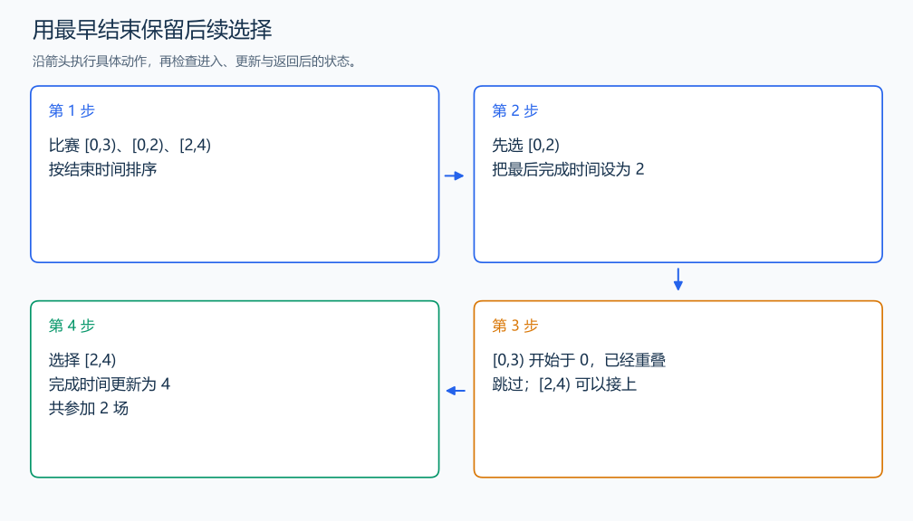

# P1803 线段覆盖

[原题入口](https://www.luogu.com.cn/problem/P1803)

对应章节：五、数据结构与算法 → （十一） 贪心算法。

## （一） 任务与输出目标

选择最多个互不重叠的比赛。

## （二） 建模与推导

先结束的比赛给后续留下最多时间。把任意最优方案的第一场替换成全体中结束最早的比赛，后续比赛依然能接上，数量不减少；去掉这场后，对剩余时间重复同样推理。于是按结束时间排序，开始时间不早于上一场结束时就选入。

## （三） 手算与过程

[0,3)、[0,2)、[2,4) 中，先选结束于 2 的比赛再选 [2,4)，共 2 场。



## （四） 带注释实现

[完整源文件](../../code/P1803.cpp)

```cpp
#include <bits/stdc++.h>
#define int long long
#define endl '\n'
using namespace std;

void solve() {
    int n;
    cin >> n;
    vector<pair<int, int>> intervals(n);
    for (auto& [end, start] : intervals)
        cin >> start >> end;
    sort(intervals.begin(), intervals.end()); // pair 第一字段保存结束时间。
    int finish = 0, answer = 0;
    for (auto [end, start] : intervals)
        if (start >= finish) {
            ++answer;
            finish = end;
        } // 选择最早结束的可接比赛。
    cout << answer << '\n';
}

signed main() {
    ios::sync_with_stdio(false); // 关闭同步，使用 cin 与 cout 完成输入输出。
    cin.tie(0), cout.tie(0);

    int T = 1; // 本题读入一组数据。
    // cin >> T; // 题目给出测试组数时开启，并在 solve 中处理一组。
    while (T--)
        solve();
}
```

## （五） 复杂度

时间 $O(n\log n)$，空间 $O(n)$。

[返回本章题解索引](README.md) · [返回全部题号索引](../../README.md)
