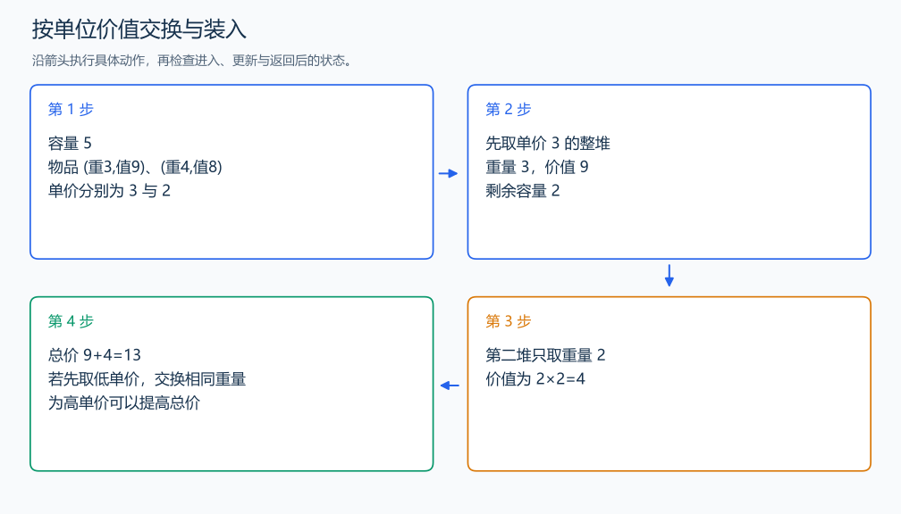

# P2240 部分背包问题

[原题入口](https://www.luogu.com.cn/problem/P2240)

对应章节：五、数据结构与算法 → （十一） 贪心算法。

## （一） 任务与输出目标

物品可以分割，按容量最大化总价值。

## （二） 建模与推导

每单位重量的价值为 v/m。若方案拿了一部分低单价物品，同时仍有高单价物品没拿，把同样重量换成高单价，价值会增加；所以从单价高到低装。容量不够装整堆时只取剩余容量对应的比例。比较单价时用交叉乘法，避免排序中的浮点误差。

## （三） 手算与过程

容量 5，两堆为 (3,9)、(4,8)：先拿 3 重量得 9，再拿第二堆 2 重量得 4，总价 13。



## （四） 带注释实现

[完整源文件](../../code/P2240.cpp)

```cpp
#include <bits/stdc++.h>
using namespace std;

struct Item { long long weight, value; };

int main() {
    int n; double capacity; cin >> n >> capacity;
    vector<Item> a(n);
    for (auto& item : a) cin >> item.weight >> item.value;
    sort(a.begin(), a.end(), [](Item x, Item y) {
        return x.value * y.weight > y.value * x.weight; // 比较单位重量价值。
    });
    double answer = 0;
    for (Item item : a) {
        double taken = min(capacity, double(item.weight));
        answer += taken * item.value / item.weight;
        capacity -= taken;
        if (capacity == 0) break;
    }
    cout << fixed << setprecision(2) << answer << '\n';
}
```

头文件 `<bits/stdc++.h>` 汇总 GNU C++ 的常用标准库，包含本程序使用的流、容器与算法；这是序言竞赛模板中的包含方式。

## （五） 复杂度

时间 $O(n\log n)$，空间 $O(n)$。

[返回本章题解索引](README.md) · [返回全部题号索引](../../README.md)
