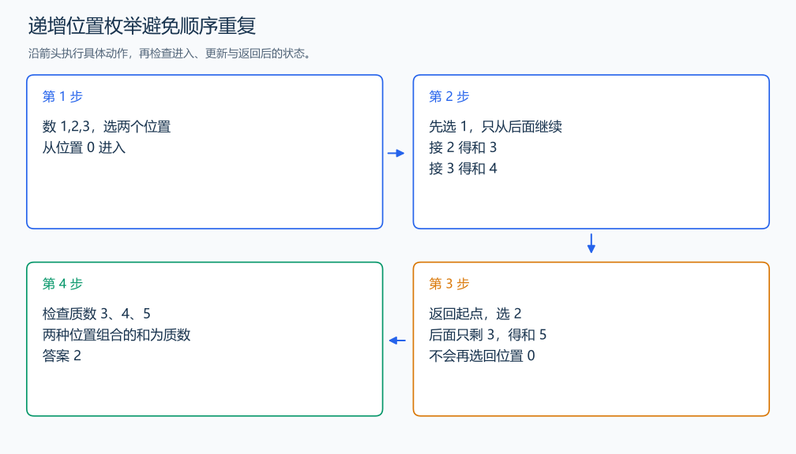

# P1036 选数

[原题入口](https://www.luogu.com.cn/problem/P1036)

对应章节：五、数据结构与算法 → （二） 枚举与模拟；五、数据结构与算法 → （五） 基础数论；五、数据结构与算法 → （十二） 搜索：递归、回溯、DFS、BFS 与记忆化。

## （一） 任务与输出目标

从 n 个数中选择 k 个位置，统计其和为质数的方案。

## （二） 建模与推导

递归参数 start 表示下一个可选位置，chosen 表示已经选了几个，sum 表示当前和。选择位置 i 后，下层从 i+1 开始，因此同一组位置只按递增顺序出现一次，避免不同选择顺序造成重复。选满 k 个时检查和是否为质数。某层剩下的位置不够补满时，就结束该分支。

## （三） 手算与过程

1,2,3 选两个：位置组合只有 (1,2)、(1,3)、(2,3)，和为 3、4、5，质数方案共 2。



## （四） 带注释实现

[完整源文件](../../code/P1036.cpp)

```cpp
#include <bits/stdc++.h> // 竞赛模板中的常用标准库工具。
#define int long long   // 统一使用较大的整数类型。
#define endl '\n'       // 普通输出换行，避免逐行刷新。
using namespace std;

int n, k; long long answer = 0;
vector<int> a;
bool prime(int x) {
    if (x < 2) return false;
    for (int d = 2; 1LL * d * d <= x; ++d) if (x % d == 0) return false;
    return true;
}
void dfs(int start, int chosen, int sum) {
    if (chosen == k) { if (prime(sum)) ++answer; return; }
    for (int i = start; i <= n - (k - chosen); ++i)
        dfs(i + 1, chosen + 1, sum + a[i]); // 下次只选更靠后的位置。
}

void solve() {
    cin >> n >> k; a.resize(n);
    for (int& x : a) cin >> x;
    dfs(0, 0, 0);
    cout << answer << '\n';
}

signed main() {
    ios::sync_with_stdio(false); // 关闭同步，使用 cin 与 cout 完成输入输出。
    cin.tie(0), cout.tie(0);

    int T = 1; // 本题读入一组数据。
    // cin >> T; // 题目给出测试组数时开启，并在 solve 中处理一组。
    while (T--)
        solve();
}
```

头文件 `<bits/stdc++.h>` 汇总 GNU C++ 的常用标准库，包含本程序使用的流、容器与算法；这是序言竞赛模板中的包含方式。

## （五） 复杂度

枚举 $\binom nk$ 个组合，最大和 S，试除时间上界 $O(\binom nk\sqrt S)$，存储与递归占 $O(n)$。

[返回本章题解索引](README.md) · [返回全部题号索引](../../README.md)
