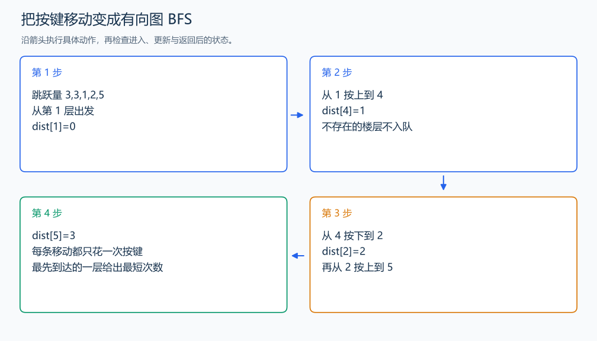

# P1135 奇怪的电梯

[原题入口](https://www.luogu.com.cn/problem/P1135)

对应章节：五、数据结构与算法 → （十二） 搜索：递归、回溯、DFS、BFS 与记忆化。

## （一） 任务与输出目标

每层只能上或下该层指定的层数，求从 A 到 B 最少按键数。

## （二） 建模与推导

楼层作为顶点，当前层 i 的两个候选邻居为 i+`K[i]`、i-`K[i]`。每条有效移动的代价为一次按键，所以用 BFS。距离数组用 -1 表示尚未到达；第一次到达就记录最短按键数并入队，最终读 B 的距离。

## （三） 手算与过程

1→4→2→5，需要 3 次按键；对应跳跃量为 3、2、3。



## （四） 带注释实现

[完整源文件](../../code/P1135.cpp)

```cpp
#include <bits/stdc++.h> // 竞赛模板中的常用标准库工具。
#define int long long   // 统一使用较大的整数类型。
#define endl '\n'       // 普通输出换行，避免逐行刷新。
using namespace std;

void solve() {
    int n, a, b; cin >> n >> a >> b;
    vector<int> jump(n+1), dist(n+1,-1);
    for (int i=1;i<=n;++i) cin >> jump[i];
    queue<int> q; q.push(a); dist[a]=0;
    while (!q.empty()) {
        int u=q.front(); q.pop();
        for (int v : {u+jump[u],u-jump[u]})
            if (v>=1 && v<=n && dist[v]==-1) {
                dist[v]=dist[u]+1; q.push(v); // 首次到达这层的按键数最少。
            }
    }
    cout << dist[b] << '\n';
}

signed main() {
    ios::sync_with_stdio(false); // 关闭同步，使用 cin 与 cout 完成输入输出。
    cin.tie(0), cout.tie(0);

    int T = 1; // 本题读入一组数据。
    // cin >> T; // 题目给出测试组数时开启，并在 solve 中处理一组。
    while (T--)
        solve();
}
```

头文件 `<bits/stdc++.h>` 汇总 GNU C++ 的常用标准库，包含本程序使用的流、容器与算法；这是序言竞赛模板中的包含方式。

## （五） 复杂度

每层最多两条候选边，时间 $O(n)$，空间 $O(n)$。

[返回本章题解索引](README.md) · [返回全部题号索引](../../README.md)
