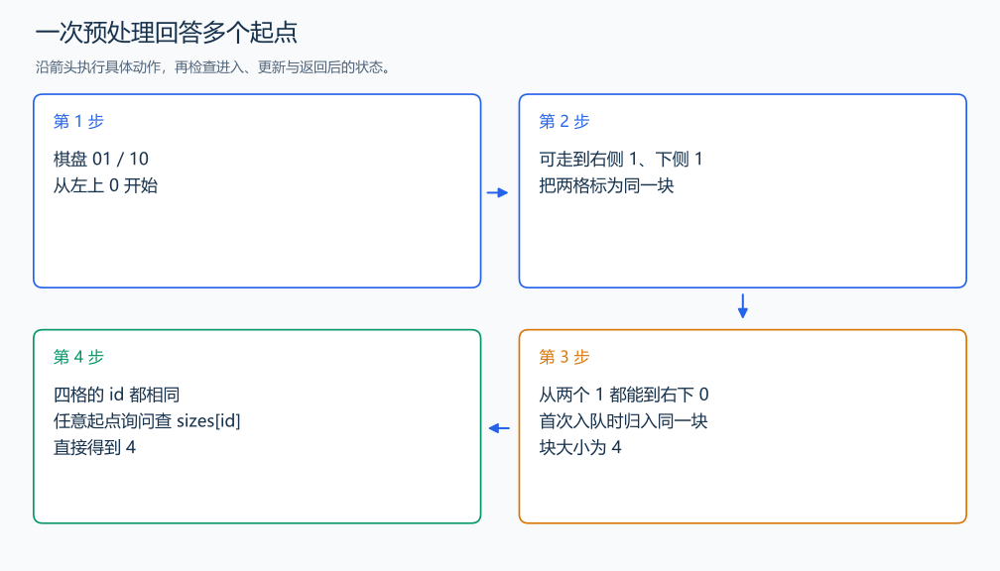

# P1141 01 迷宫

[原题入口](https://www.luogu.com.cn/problem/P1141)

对应章节：五、数据结构与算法 → （十二） 搜索：递归、回溯、DFS、BFS 与记忆化。

## （一） 任务与输出目标

邻格数字不同才能移动，回答每个起点能到达多少格。

## （二） 建模与推导

数字不同的相邻格子之间可以双向移动，所以能到达的格子构成连通块。同一块内所有起点的答案相同，不必每次询问重新 BFS。预处理块编号 id 和块大小 size；搜索时仅沿数字不同的边扩展，询问时直接读 `size[id[x][y]]`。

## （三） 手算与过程

棋盘 01/10 的四格都通过不同数字的邻边连通，任何格子的答案都为 4。



## （四） 带注释实现

[完整源文件](../../code/P1141.cpp)

```cpp
#include <bits/stdc++.h>
using namespace std;


int main() {
    ios::sync_with_stdio(false); cin.tie(nullptr);
    int n, qn; cin >> n >> qn;
    vector<string> a(n); for (auto& row : a) cin >> row;
    vector<vector<int>> id(n, vector<int>(n, -1)); vector<int> sizes;
    int dx[4]={1,-1,0,0}, dy[4]={0,0,1,-1};
    for (int i=0;i<n;++i) for (int j=0;j<n;++j) {
        if (id[i][j] != -1) continue;
        int block = sizes.size(), count = 0;
        queue<pair<int,int>> q; q.emplace(i,j); id[i][j] = block;
        while (!q.empty()) {
            auto [x,y] = q.front(); q.pop(); ++count;
            for (int d=0;d<4;++d) {
                int u=x+dx[d], v=y+dy[d];
                if (u>=0 && u<n && v>=0 && v<n && id[u][v]==-1 && a[u][v]!=a[x][y]) {
                    id[u][v]=block; q.emplace(u,v); // 沿不同数字的边归入同一块。
                }
            }
        }
        sizes.push_back(count);
    }
    while (qn--) { int x,y; cin >> x >> y; cout << sizes[id[x-1][y-1]] << '\n'; }
}
```

头文件 `<bits/stdc++.h>` 汇总 GNU C++ 的常用标准库，包含本程序使用的流、容器与算法；这是序言竞赛模板中的包含方式。

## （五） 复杂度

预处理 $O(n^2)$，q 次询问 $O(q)$，空间 $O(n^2)$。

[返回本章题解索引](README.md) · [返回全部题号索引](../../README.md)
