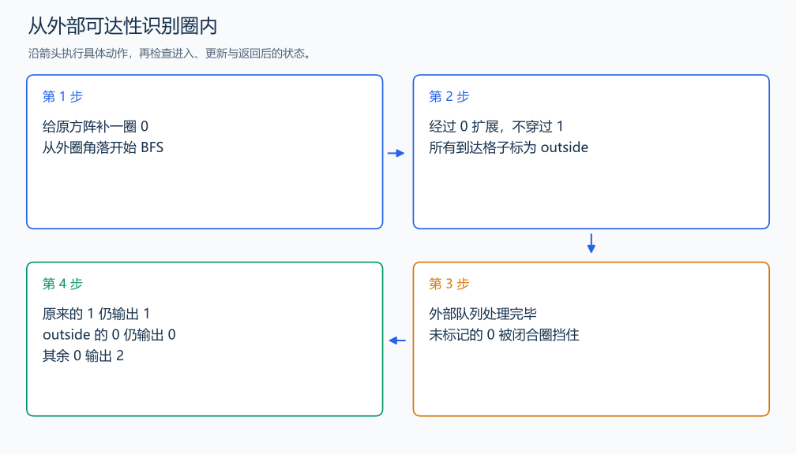

# P1162 填涂颜色

[原题入口](https://www.luogu.com.cn/problem/P1162)

对应章节：五、数据结构与算法 → （十二） 搜索：递归、回溯、DFS、BFS 与记忆化。

## （一） 任务与输出目标

把闭合圈内的 0 改成 2，圈外的 0 保留。

## （二） 建模与推导

直接猜圈内起点很难，先找所有圈外格子。给方阵外面补一圈 0，从外圈角落 BFS，只经过 0。能到达的是外部；搜索结束后，未到达的 0 都被 1 围住，输出 2。补圈让四条边的外部自然连成一个起点可达区域。

## （三） 手算与过程

3×3 中外围全为 1、中心为 0：外部 BFS 无法进入中心，中心输出 2。



## （四） 带注释实现

[完整源文件](../../code/P1162.cpp)

```cpp
#include <bits/stdc++.h>
using namespace std;


int main() {
    int n; cin >> n;
    vector<vector<int>> a(n + 2, vector<int>(n + 2, 0));
    vector<vector<bool>> outside(n + 2, vector<bool>(n + 2, false));
    for (int i = 1; i <= n; ++i) for (int j = 1; j <= n; ++j) cin >> a[i][j];
    queue<pair<int,int>> q; q.emplace(0, 0); outside[0][0] = true;
    int dx[4] = {1,-1,0,0}, dy[4] = {0,0,1,-1};
    while (!q.empty()) {
        auto [x,y] = q.front(); q.pop();
        for (int d = 0; d < 4; ++d) {
            int u = x + dx[d], v = y + dy[d];
            if (u >= 0 && u <= n + 1 && v >= 0 && v <= n + 1 && !a[u][v] && !outside[u][v]) {
                outside[u][v] = true; q.emplace(u,v); // 从外面到达的 0 保持原样。
            }
        }
    }
    for (int i = 1; i <= n; ++i) {
        for (int j = 1; j <= n; ++j) {
            if (a[i][j] == 0 && !outside[i][j]) a[i][j] = 2;
            cout << a[i][j] << ' ';
        }
        cout << '\n';
    }
}
```

头文件 `<bits/stdc++.h>` 汇总 GNU C++ 的常用标准库，包含本程序使用的流、容器与算法；这是序言竞赛模板中的包含方式。

## （五） 复杂度

时间与空间均为 $O(n^2)$。

[返回本章题解索引](README.md) · [返回全部题号索引](../../README.md)
