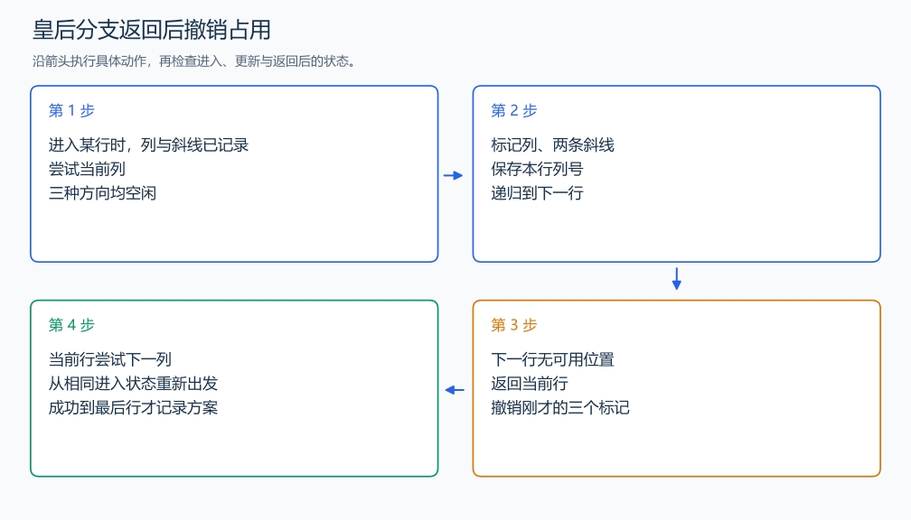

# P1219 八皇后

[原题入口](https://www.luogu.com.cn/problem/P1219)

对应章节：五、数据结构与算法 → （十二） 搜索：递归、回溯、DFS、BFS 与记忆化。

## （一） 任务与输出目标

在 n×n 棋盘上每行放一枚皇后，输出字典序前三个方案及总方案数。

## （二） 建模与推导

每层处理一行，尝试列号从小到大。列冲突用 `col[c]`，两种斜线分别由 row+c 和 row-c+n 标识。选一个位置时标记三个方向，递归下一行，返回后撤销这些标记，让下一列在同一个进入状态上继续尝试。较小列的子树先遍历，方案自然按字典序出现。

## （三） 手算与过程

4×4 中第一种方案为 2,4,1,3；一条分支走不下去时逐层返回，撤销后尝试本层下一列。



## （四） 带注释实现

[完整源文件](../../code/P1219.cpp)

```cpp
#include <bits/stdc++.h>
using namespace std;

int n, position[20];
bool col[20], down[40], up[40];
long long answer = 0;
void dfs(int row) {
    if (row == n + 1) {
        ++answer;
        if (answer <= 3) {
            for (int i = 1; i <= n; ++i) cout << position[i] << ' ';
            cout << '\n';
        }
        return;
    }
    for (int c = 1; c <= n; ++c) {
        if (col[c] || down[row + c] || up[row - c + n]) continue;
        position[row] = c;
        col[c] = down[row + c] = up[row - c + n] = true; // 选择并保存当前行。
        dfs(row + 1);
        col[c] = down[row + c] = up[row - c + n] = false; // 返回后恢复进入本层时的占用状态。
    }
}

int main() {
    cin >> n;
    dfs(1);
    cout << answer << '\n';
}
```

头文件 `<bits/stdc++.h>` 汇总 GNU C++ 的常用标准库，包含本程序使用的流、容器与算法；这是序言竞赛模板中的包含方式。

## （五） 复杂度

搜索上界 $O(n\cdot n!)$，列和递归记录占 $O(n)$。

[返回本章题解索引](README.md) · [返回全部题号索引](../../README.md)
