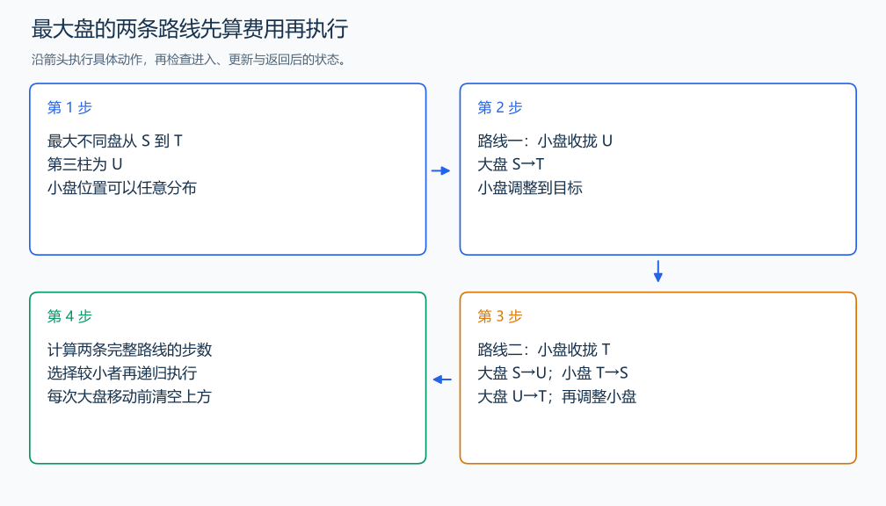

# P1242 新汉诺塔

[原题入口](https://www.luogu.com.cn/problem/P1242)

对应章节：五、数据结构与算法 → （十二） 搜索：递归、回溯、DFS、BFS 与记忆化。

## （一） 任务与输出目标

任意合法初态变到任意目标态，输出最少移动步骤与总数。

## （二） 建模与推导

从最大的圆盘 n 开始。它的柱子已经与目标相同时，处理更小盘；不同时，设来源为 S、目标为 T、第三柱为 U。最大盘的两种路线必须比较。

路线一只移动最大盘一次：先把小盘全收拢到 U，移动 n 从 S 到 T，再把小盘从 U 变到目标。路线二移动最大盘两次：先把小盘收拢到 T，移动 n 从 S 到 U；把小盘整塔从 T 搬到 S，移动 n 从 U 到 T；最后调整小盘到目标。小盘整塔移动需 2^(n-1)-1 步。

最大盘多走的路线会出现往返或三柱循环。往返可以删掉；绕一圈时，小盘两次整塔转移加三次大盘移动，可以改成一次小盘整塔转移，步数更少。因此最短方案只需比较上面的两条路线。

先写 costToTower：若第 k 个盘已在目标柱，递归 k-1；否则先收拢更小盘到第三柱，再移 k，最后把小盘整塔搬到目标柱，费用为前一递归加 2^(k-1)。从目标态收拢到 U 的费用，也等于从 U 整塔变到目标态的费用，因为每步可逆。比较得到最小路线后，再实际执行并打印。

## （三） 手算与过程

两盘都在 A，目标都在 C：1 从 A 到 B，2 从 A 到 C，1 从 B 到 C，共 3 步。任意状态下还需比较最大盘走两次的路线。



## （四） 带注释实现

[完整源文件](../../code/P1242.cpp)

```cpp
#include <bits/stdc++.h>
#define int long long
#define endl '\n'
using namespace std;

int pos[46], goal[46];
int moves = 0;

int towerCost(const int state[], int k, int dest) {
    if (k == 0)
        return 0;
    if (state[k] == dest)
        return towerCost(state, k - 1, dest);
    int other = 6 - state[k] - dest;
    return towerCost(state, k - 1, other) + (1LL << (k - 1)); // 收小盘、移大盘、再搬整塔。
}

void moveDisk(int k, int dest) {
    cout << "move " << k << " from " << char('A' + pos[k] - 1) << " to " << char('A' + dest - 1)
         << '\n';
    pos[k] = dest;
    ++moves;
}

void gather(int k, int dest) {
    if (k == 0)
        return;
    if (pos[k] == dest) {
        gather(k - 1, dest);
        return;
    }
    int other = 6 - pos[k] - dest;
    gather(k - 1, other);
    moveDisk(k, dest);
    gather(k - 1, dest); // 每次大盘移动前清空上方。
}

void transform(int k) {
    if (k == 0)
        return;
    if (pos[k] == goal[k]) {
        transform(k - 1);
        return;
    }
    int source = pos[k], dest = goal[k], other = 6 - source - dest;
    int direct = towerCost(pos, k - 1, other) + 1 + towerCost(goal, k - 1, other);
    int via = towerCost(pos, k - 1, dest) + (1LL << (k - 1)) + 1 + towerCost(goal, k - 1, source);
    if (direct <= via) {
        gather(k - 1, other);
        moveDisk(k, dest);
        transform(k - 1);
    } else {
        gather(k - 1, dest);
        moveDisk(k, other);
        gather(k - 1, source);
        moveDisk(k, dest);
        transform(k - 1);
    }
}

void solve() {
    int n;
    cin >> n;
    for (int peg = 1; peg <= 3; ++peg) {
        int count;
        cin >> count;
        while (count--) {
            int disk;
            cin >> disk;
            pos[disk] = peg;
        }
    }
    for (int peg = 1; peg <= 3; ++peg) {
        int count;
        cin >> count;
        while (count--) {
            int disk;
            cin >> disk;
            goal[disk] = peg;
        }
    }
    transform(n);
    cout << moves << '\n';
}

signed main() {
    ios::sync_with_stdio(false); // 关闭同步，使用 cin 与 cout 完成输入输出。
    cin.tie(0), cout.tie(0);

    int T = 1; // 本题读入一组数据。
    // cin >> T; // 题目给出测试组数时开启，并在 solve 中处理一组。
    while (T--)
        solve();
}
```

## （五） 复杂度

设实际输出步数为 L，路线费用比较上界 $O(n^2)$，生成动作上界 $O(nL)$；递归与位置记录 $O(n)$。

[返回本章题解索引](README.md) · [返回全部题号索引](../../README.md)
