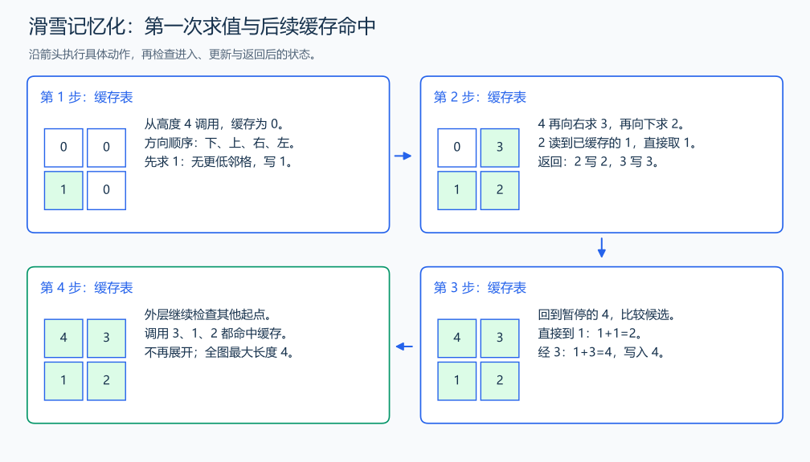

# P1434 滑雪

[原题入口](https://www.luogu.com.cn/problem/P1434)

对应章节：五、数据结构与算法 → （十二） 搜索：递归、回溯、DFS、BFS 与记忆化。

## （一） 任务与输出目标

在上下左右严格降高的路径中求最大经过格子数。

## （二） 建模与推导

定义 f(x,y) 为从当前格子出发的最长下降路径长度，包含当前格。先考虑最后不再滑，长度为 1；若滑到某个更低邻格 u,v，删掉第一格后，剩下恰好是从 u,v 出发的子问题，接回当前格便得到 1+f(u,v)。较差的后续路径换成最佳后续不会改变下降关系，所以只需各邻格的最优值，取最大。高度每次严格降低，依赖不会绕回当前状态。

递归首次遇到一个格子时计算，全部邻格处理完后写入缓存；再次遇到它直接返回。答案取所有起点中的最大值。这里 f 只依赖当前位置和地图，不依赖之前走过的路径，因为更高的已走格子无法再次成为下降候选。

## （三） 手算与过程

高度 4,3/1,2：3→2→1 的长度为 3，4→3→2→1 的长度为 4；从其他起点再次遇到 2 时直接读取已算出的 2。



## （四） 带注释实现

[完整源文件](../../code/P1434.cpp)

```cpp
#include <bits/stdc++.h>
#define int long long
#define endl '\n'
using namespace std;

int n, m;
vector<vector<int>> height, memo;
int dx[4] = {1, -1, 0, 0}, dy[4] = {0, 0, 1, -1};

int dfs(int x, int y) {
    if (memo[x][y])
        return memo[x][y]; // 命中：不再展开相同子问题。
    int best = 1;
    for (int d = 0; d < 4; ++d) {
        int u = x + dx[d], v = y + dy[d];
        if (u >= 0 && u < n && v >= 0 && v < m && height[u][v] < height[x][y])
            best = max(best, 1 + dfs(u, v)); // 去掉当前格后读取子问题，再接回一格。
    }
    return memo[x][y] = best; // 邻格全部完成后，写入完整答案。
}

void solve() {
    cin >> n >> m;
    height.assign(n, vector<int>(m));
    memo.assign(n, vector<int>(m, 0));
    for (auto& row : height)
        for (int& x : row)
            cin >> x;
    int answer = 0;
    for (int x = 0; x < n; ++x)
        for (int y = 0; y < m; ++y)
            answer = max(answer, dfs(x, y));
    cout << answer << '\n';
}

signed main() {
    ios::sync_with_stdio(false); // 关闭同步，使用 cin 与 cout 完成输入输出。
    cin.tie(0), cout.tie(0);

    int T = 1; // 本题读入一组数据。
    // cin >> T; // 题目给出测试组数时开启，并在 solve 中处理一组。
    while (T--)
        solve();
}
```

## （五） 复杂度

每格只展开一次、检查四邻格，时间 $O(nm)$；缓存与最深递归路径占 $O(nm)$。

[返回本章题解索引](README.md) · [返回全部题号索引](../../README.md)
