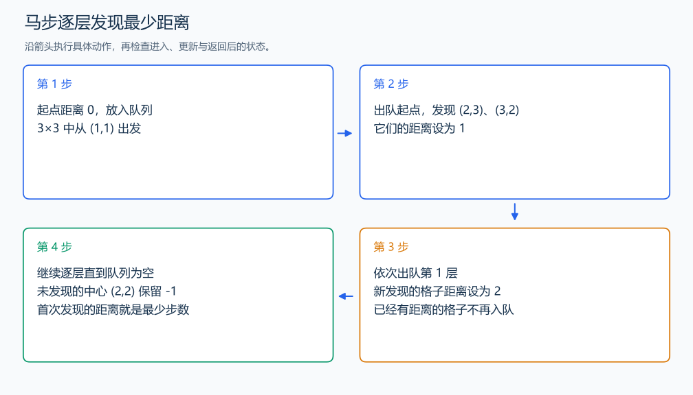

# P1443 马的遍历

[原题入口](https://www.luogu.com.cn/problem/P1443)

对应章节：五、数据结构与算法 → （十二） 搜索：递归、回溯、DFS、BFS 与记忆化。

## （一） 任务与输出目标

从给定起点出发，输出马到棋盘每格所需的最少步数。

## （二） 建模与推导

每次马步的代价都是 1。BFS 按距离逐层扩展：起点距离为 0，第一次发现的邻格距离为当前距离加一；更短路径若存在，它的前驱必在更早一层，早已发现该格。因此首次发现即可定下最少步数。八个方向来自 (±1,±2)、(±2,±1)。

## （三） 手算与过程

3×3 棋盘从 (1,1) 出发，(2,3)、(3,2) 在第 1 层；它们的新邻格在第 2 层。中心 (2,2) 不可达。



## （四） 带注释实现

[完整源文件](../../code/P1443.cpp)

```cpp
#include <bits/stdc++.h> // 竞赛模板中的常用标准库工具。
#define int long long   // 统一使用较大的整数类型。
#define endl '\n'       // 普通输出换行，避免逐行刷新。
using namespace std;

void solve() {
    int n,m,sx,sy; cin >> n >> m >> sx >> sy; --sx; --sy;
    vector<vector<int>> dist(n, vector<int>(m,-1));
    queue<pair<int,int>> q; q.emplace(sx,sy); dist[sx][sy]=0;
    int dx[8]={1,1,-1,-1,2,2,-2,-2}, dy[8]={2,-2,2,-2,1,-1,1,-1};
    while (!q.empty()) {
        auto [x,y]=q.front(); q.pop();
        for (int d=0;d<8;++d) {
            int u=x+dx[d], v=y+dy[d];
            if (u>=0 && u<n && v>=0 && v<m && dist[u][v]==-1) {
                dist[u][v]=dist[x][y]+1; q.emplace(u,v); // 首次发现来自最短前驱层。
            }
        }
    }
    for (auto& row : dist) { for (int x : row) cout << left << setw(5) << x; cout << '\n'; }
}

signed main() {
    ios::sync_with_stdio(false); // 关闭同步，使用 cin 与 cout 完成输入输出。
    cin.tie(0), cout.tie(0);

    int T = 1; // 本题读入一组数据。
    // cin >> T; // 题目给出测试组数时开启，并在 solve 中处理一组。
    while (T--)
        solve();
}
```

头文件 `<bits/stdc++.h>` 汇总 GNU C++ 的常用标准库，包含本程序使用的流、容器与算法；这是序言竞赛模板中的包含方式。

## （五） 复杂度

时间与空间均为 $O(nm)$。

[返回本章题解索引](README.md) · [返回全部题号索引](../../README.md)
