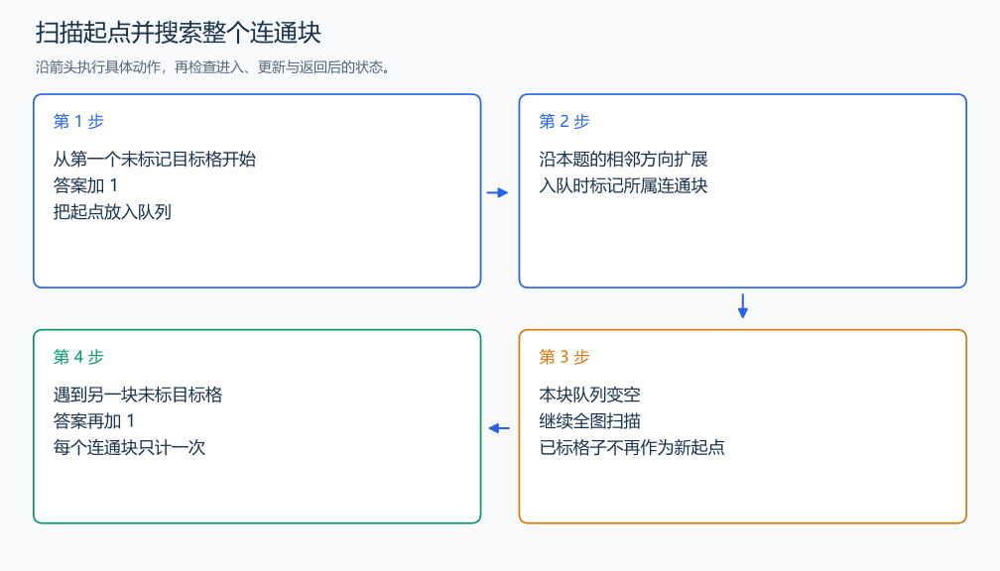

# P1596 湖计数

[原题入口](https://www.luogu.com.cn/problem/P1596)

对应章节：五、数据结构与算法 → （十五） 图论入门。

## （一） 任务与输出目标

统计 W 在八方向相连的水塘数量。

## （二） 建模与推导

逐格找尚未归入连通块的目标格子。找到一个就把答案加一，再搜索所有与它连通的目标格子并永久标记。以后扫描遇到这些格子时跳过，每块只由第一个未标记格子计数一次。标记在入队时完成，避免相邻格子重复把它放进队列。

本题斜向接触也连通，方向枚举包括八个邻格。

## （三） 手算与过程

2×2 中左上、右下都是 W，斜向连接形成一个水塘。



## （四） 带注释实现

[完整源文件](../../code/P1596.cpp)

```cpp
#include <bits/stdc++.h> // 竞赛模板中的常用标准库工具。
#define int long long   // 统一使用较大的整数类型。
#define endl '\n'       // 普通输出换行，避免逐行刷新。
using namespace std;

bool target(char c) { return c == 'W'; }

void solve() {
    int n, m; cin >> n >> m;
    vector<string> a(n); for (auto& row : a) cin >> row;
    int answer = 0;
    for (int i = 0; i < n; ++i) for (int j = 0; j < m; ++j) {
        if (!target(a[i][j])) continue;
        ++answer;
        queue<pair<int,int>> q; q.emplace(i, j); a[i][j] = '.';
        while (!q.empty()) {
            auto [x, y] = q.front(); q.pop();
            for (int dx = -1; dx <= 1; ++dx) for (int dy = -1; dy <= 1; ++dy) {
                if (dx == 0 && dy == 0) continue;

                int u = x + dx, v = y + dy;
                if (u >= 0 && u < n && v >= 0 && v < m && target(a[u][v])) {
                    a[u][v] = '.'; q.emplace(u, v); // 入队时把格子归入本块。
                }
            }
        }
    }
    cout << answer << '\n';
}

signed main() {
    ios::sync_with_stdio(false); // 关闭同步，使用 cin 与 cout 完成输入输出。
    cin.tie(0), cout.tie(0);

    int T = 1; // 本题读入一组数据。
    // cin >> T; // 题目给出测试组数时开启，并在 solve 中处理一组。
    while (T--)
        solve();
}
```

头文件 `<bits/stdc++.h>` 汇总 GNU C++ 的常用标准库，包含本程序使用的流、容器与算法；这是序言竞赛模板中的包含方式。

## （五） 复杂度

每个格子检查固定数量的邻居，时间 $O(nm)$，地图与队列占 $O(nm)$。

[返回本章题解索引](README.md) · [返回全部题号索引](../../README.md)
