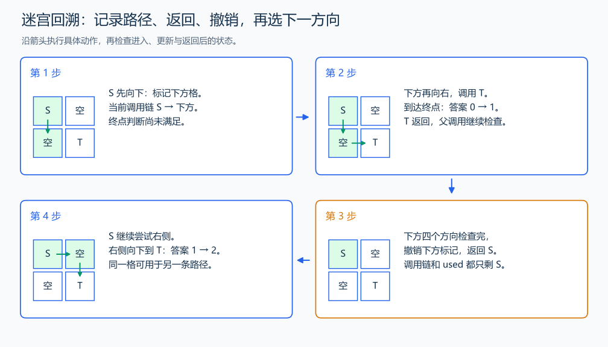

# P1605 迷宫

[原题入口](https://www.luogu.com.cn/problem/P1605)

对应章节：序言 → 建议的自学顺序与练习；五、数据结构与算法 → （十二） 搜索：递归、回溯、DFS、BFS 与记忆化。

## （一） 任务与输出目标

统计起点到终点的所有不重复经过格子的路径。

## （二） 建模与推导

used 表示当前这条路径已经经过的格子。进入一个格子后标记，依次尝试四个方向；到终点就计入一条完整路径，不再延伸。返回父格时撤销标记，其他路径仍能使用这个格子。这里不能永久标记，因为目标是统计所有路径；同样的位置由不同前缀到达，后续可走的格子也不同，不能只按坐标记忆化。

## （三） 手算与过程

2×2 无障碍，从左上到右下：先下后右、先右后下，共 2 条；第一条返回后必须撤销下方格子的标记。



## （四） 带注释实现

[完整源文件](../../code/P1605.cpp)

```cpp
#include <bits/stdc++.h> // 竞赛模板中的常用标准库工具。
#define int long long   // 统一使用较大的整数类型。
#define endl '\n'       // 普通输出换行，避免逐行刷新。
using namespace std;

int n, m, obstacles, tx, ty;
long long answer = 0;
bool blocked[7][7], used[7][7];
int dx[4] = {1, -1, 0, 0}, dy[4] = {0, 0, 1, -1};
void dfs(int x, int y) {
    if (x == tx && y == ty) { ++answer; return; }
    used[x][y] = true; // 标记只属于当前路径。
    for (int d = 0; d < 4; ++d) {
        int u = x + dx[d], v = y + dy[d];
        if (u >= 1 && u <= n && v >= 1 && v <= m && !blocked[u][v] && !used[u][v]) dfs(u, v);
    }
    used[x][y] = false; // 返回时让其他前缀路径能够再使用这里。
}

void solve() {
    cin >> n >> m >> obstacles;
    int sx, sy; cin >> sx >> sy >> tx >> ty;
    for (int i = 0; i < obstacles; ++i) { int x, y; cin >> x >> y; blocked[x][y] = true; }
    dfs(sx, sy);
    cout << answer << '\n';
}

signed main() {
    ios::sync_with_stdio(false); // 关闭同步，使用 cin 与 cout 完成输入输出。
    cin.tie(0), cout.tie(0);

    int T = 1; // 本题读入一组数据。
    // cin >> T; // 题目给出测试组数时开启，并在 solve 中处理一组。
    while (T--)
        solve();
}
```

头文件 `<bits/stdc++.h>` 汇总 GNU C++ 的常用标准库，包含本程序使用的流、容器与算法；这是序言竞赛模板中的包含方式。

## （五） 复杂度

搜索树规模为指数级，宽松上界 $O(4^{nm})$；地图和当前路径占 $O(nm)$。

[返回本章题解索引](README.md) · [返回全部题号索引](../../README.md)
