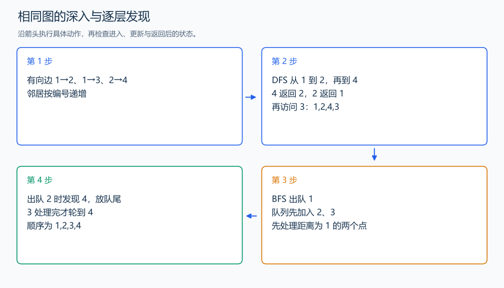

# P5318 查找文献

[原题入口](https://www.luogu.com.cn/problem/P5318)

对应章节：五、数据结构与算法 → （十二） 搜索：递归、回溯、DFS、BFS 与记忆化。

## （一） 任务与输出目标

从编号 1 开始对有向图进行 DFS 和 BFS，邻居按编号从小到大访问。

## （二） 建模与推导

先排序每个顶点的出边。DFS 用栈保存候选，按邻居编号从大到小压栈，使较小编号先弹出；弹出时检查是否已访问，避免不同路径重复输出。BFS 则在发现邻居时立刻标记并入队，保持层次和同层发现顺序。两次遍历分别重新准备访问数组。

## （三） 手算与过程

边 1→2、1→3、2→4：DFS 输出 1,2,4,3；BFS 输出 1,2,3,4。



## （四） 带注释实现

[完整源文件](../../code/P5318.cpp)

```cpp
#include <bits/stdc++.h>
#define int long long
#define endl '\n'
using namespace std;

void solve() {
    int n, m;
    cin >> n >> m;
    vector<vector<int>> g(n + 1);
    while (m--) {
        int u, v;
        cin >> u >> v;
        g[u].push_back(v);
    }
    for (auto& row : g)
        sort(row.begin(), row.end());
    vector<bool> visited(n + 1, false);
    stack<int> pending;
    pending.push(1);
    while (!pending.empty()) {
        int u = pending.top();
        pending.pop();
        if (visited[u])
            continue;
        visited[u] = true;
        cout << u << ' ';
        for (auto it = g[u].rbegin(); it != g[u].rend(); ++it)
            if (!visited[*it])
                pending.push(*it); // 反序压栈，正序访问。
    }
    cout << '\n';
    fill(visited.begin(), visited.end(), false);
    queue<int> q;
    q.push(1);
    visited[1] = true;
    while (!q.empty()) {
        int u = q.front();
        q.pop();
        cout << u << ' ';
        for (int v : g[u])
            if (!visited[v]) {
                visited[v] = true;
                q.push(v); // 发现时标记，同一顶点只入队一次。
            }
    }
    cout << '\n';
}

signed main() {
    ios::sync_with_stdio(false); // 关闭同步，使用 cin 与 cout 完成输入输出。
    cin.tie(0), cout.tie(0);

    int T = 1; // 本题读入一组数据。
    // cin >> T; // 题目给出测试组数时开启，并在 solve 中处理一组。
    while (T--)
        solve();
}
```

## （五） 复杂度

排序时间上界 $O(m\log m)$，两次遍历 $O(n+m)$；含候选栈的空间 $O(n+m)$。

[返回本章题解索引](README.md) · [返回全部题号索引](../../README.md)
